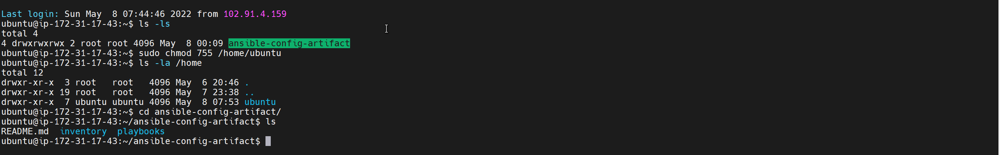
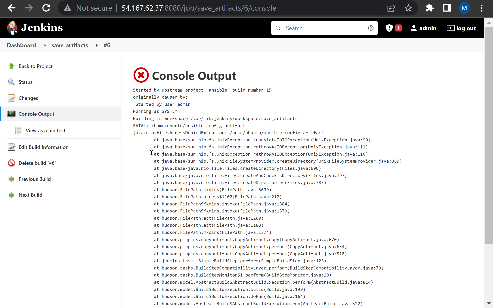
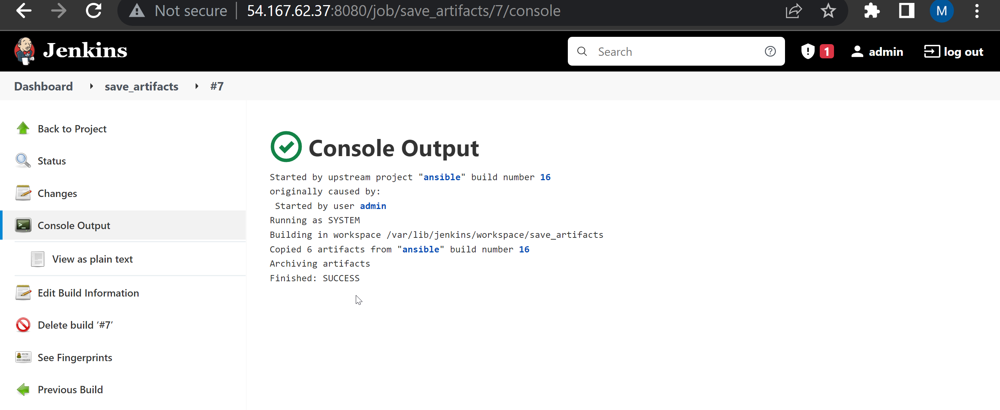

# ANSIBLE REFACTORING AND STATIC ASSIGNMENTS (IMPORTS AND ROLES)

We will be refactoring the last ansible project.

### **Step 1 – Jenkins job enhancement**

1. Download "Copy Artifacts" plugin on jenkins. This will help us copy all our artifacts to a specific directory in our Jenkins server
- Go to Jenkins web **console -> Manage Jenkins -> Manage Plugins** -> on Available tab search for **Copy Artifact** and install this plugin without restarting Jenkins


2. Make a directory inside the root directory.
```
sudo mkdir /home/ubuntu/ansible-config-artifact
```

3. Change permissions to this directory, so Jenkins could save files there
```
sudo chmod 0777 /home/ubuntu/ansible-config-artifact
```
NOTE: Alao change the directory of /home/ubuntu with `sudo chmod 755 /home/ubuntu/` 



Else you'd get permission errors on your jenkins run like below.



4. Create a new Freestyle project and name it **save_artifacts.**


5. This project will be triggered by completion of the existing ansible project. Configure it accordingly


6. Configure the directory where you want to copy your artifacts.
<br>

- create a Build step and **choose Copy artifacts** from other project
- specify ansible as a source project and /home/ubuntu/ansible-config-artifact as a target directory.




### **Step 2 – Refactor Ansible code by importing other playbooks**

Importing Playbooks is a great way to refactor your Ansible code. It is a great way to reuse code. We can import other playbooks into a particular playbook. Breaking tasks up into different files is an excellent way to organize complex sets of tasks and reuse them.


1. Within playbooks folder, create a new file and name it **site.yml** – This file will now be considered as an entry point into the entire infrastructure configuration.

2. Create a new folder in root of the repository and name it **static-assignments.** The static-assignments folder is where all other children playbooks will be stored. <br>


3. We will move common.yml into static-assignments folder.

4. Import common.yml into site.yml. Update site.yml as follows:
```
---
- hosts: all
- import_playbook: ../static-assignments/common.yml
```

5. We can also create a new yml file called **common-del.yml** under static-assignments. This will delete wireshark installation we made in the last project. <br>

Add the following to common-del.yml:
```
---
- name: update web, nfs and db servers
  hosts: webservers, nfs, db
  remote_user: ec2-user
  become: yes
  become_user: root
  tasks:
  - name: delete wireshark
    yum:
      name: wireshark
      state: removed

- name: update LB server
  hosts: lb
  remote_user: ubuntu
  become: yes
  become_user: root
  tasks:
  - name: delete wireshark
    apt:
      name: wireshark-qt
      state: absent
      autoremove: yes
      purge: yes
      autoclean: yes

```


6. update site.yml with **-import_playbook: ../static-assignments/common-del.yml** and run the playbook against the dev environment servers (dev.yml)
 
7. Ruuning `wireshark --version` on the webservers should return an error.


### **Step 3 – Configure UAT Webservers with a role ‘Webserver’**
We will create and configure our UAT Servers
<br>
We could write tasks to configure Web Servers in the same playbook, but it would be too messy, instead, we will use a dedicated role to make our configuration reusable.

1. Launch 2 EC2 RHEL instance. (web1-uat, web2-uat)


2. To create a role, you must create a directory called roles/, relative to the playbook file or in /etc/ansible/ directory. I created my roles folder in my ansible-config-mgt project.

<br>

Creating folder structure can be done in two ways:
- Use an Ansible utility called ansible-galaxy inside ansible-config-mgt/roles directory (you need to create roles directory upfront) - I used this option
```
mkdir roles
cd roles
ansible-galaxy init webserver
```
- Create the directory/files structure manually


3. Update inventory/uat.yml file:
```
[uat-webservers]
<Web1-UAT-Server-Private-IP-Address> ansible_ssh_user='ec2-user'
<Web2-UAT-Server-Private-IP-Address> ansible_ssh_user='ec2-user'
```


4. In **/etc/ansible/ansible.cfg** file uncomment **roles_path** string and provide a full path to your roles directory **roles_path= /home/ubuntu/ansible-config-artifact/roles**, so Ansible could know where to find configured roles.

5. Go into tasks directory, and within the main.yml file, start writing configuration tasks to do the following:

```
---
- name: install apache
  become: true
  ansible.builtin.yum:
    name: "httpd"
    state: present

- name: install git
  become: true
  ansible.builtin.yum:
    name: "git"
    state: present

- name: clone a repo
  become: true
  ansible.builtin.git:
    repo: https://github.com/<your-name>/tooling.git
    dest: /var/www/html
    force: yes

- name: copy html content to one level up
  become: true
  command: cp -r /var/www/html/html/ /var/www/

- name: Start service httpd, if not started
  become: true
  ansible.builtin.service:
    name: httpd
    state: started

- name: recursively remove /var/www/html/html/ directory
  become: true
  ansible.builtin.file:
    path: /var/www/html/html
    state: absent
```

The least of tasks above include:
- Install and configure Apache (httpd service)
- Clone Tooling website from GitHub https://github.com/royalt1234/tooling.git
- Ensure the tooling website code is deployed to /var/www/html on each of 2 UAT Web servers.
- Make sure httpd service is started


### **Step 4 – Reference ‘Webserver’ role**

1. Create a new assignment for uat-webservers **static-assignments/uat-webservers.yml.** and refrence the webserver role inside the file as foollows:
```
---
- hosts: uat-webservers
  roles:
    - webserver
```
2. Update site.yml to include the following:
```
---
- hosts: all
- import_playbook: ../static-assignments/common.yml

- hosts: uat-webservers
- import_playbook: ../static-assignments/uat-webservers.yml

```


3. Commit your changes, create a Pull Request and merge them to master branch, make sure webhook triggered two consequent Jenkins jobs, they ran successfully and copied all the files to your Jenkins-Ansible server into `/home/ubuntu/ansible-config-mgt/` directory.

Now run the playbook against your uat inventory and see what happens:

```
sudo ansible-playbook -i /home/ubuntu/ansible-config-mgt/inventory/uat.yml /home/ubuntu/ansible-config-mgt/playbooks/site.yml
```


You should be able to see both of your UAT Web servers configured and you can try to reach them from your browser:

**http://Web1-UAT-Server-Public-IP-or-Public-DNS-Name/index.php**

or

**http://Web2-UAT-Server-Public-IP-or-Public-DNS-Name/index.php**

