# LOAD BALANCER SOLUTION WITH NGINX AND SSL/TLS

### Part 1 – Configure Nginx As A Load Balancer
1. Spin up an EC2 server with Ubuntu OS and install Nginx. Open port 80 and HTTPS port 443.
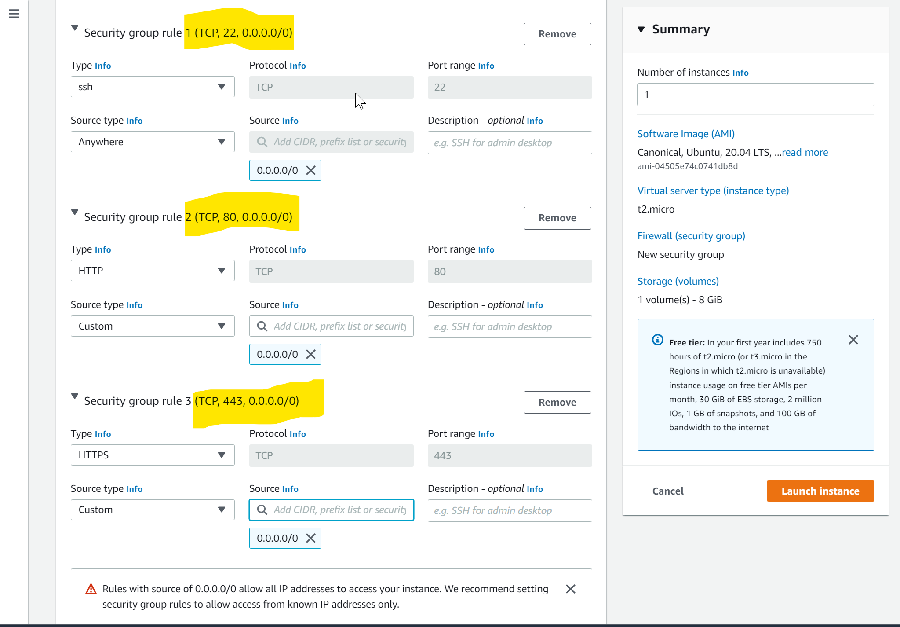

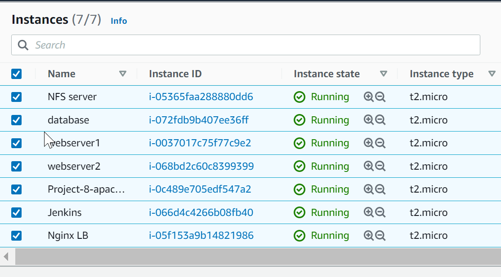


2. Update /etc/hosts file for local DNS with Web Servers names (e.g. Web1 and Web2) and their local IP addresses just like it was done with the apache load balancer.

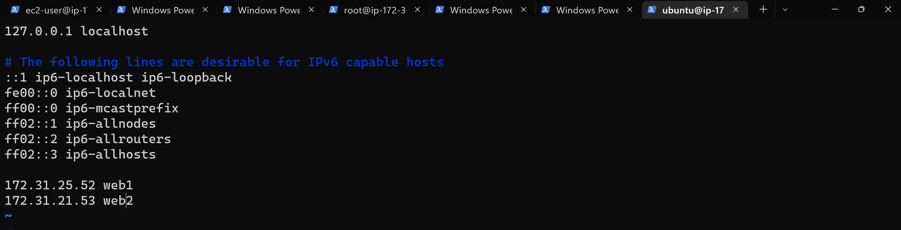


3. configure Nginx as a load balancer to point traffic to the resolvable DNS names of the webservers
```
sudo vi /etc/nginx/nginx.conf

#insert following configuration into http section

 upstream myproject {
    server Web1 weight=5;
    server Web2 weight=5;
  }

server {
    listen 80;
    server_name www.domain.com;
    location / {
      proxy_pass http://myproject;
    }
  }

#comment out this line
#       include /etc/nginx/sites-enabled/*;
```

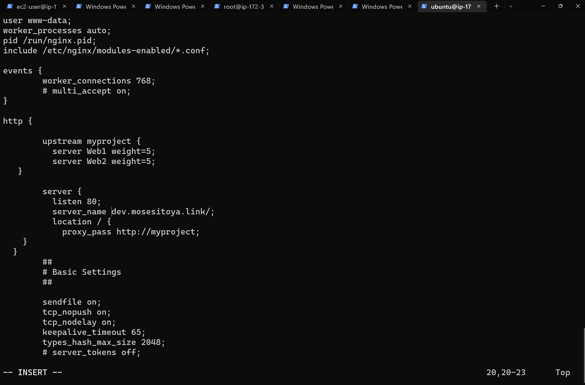

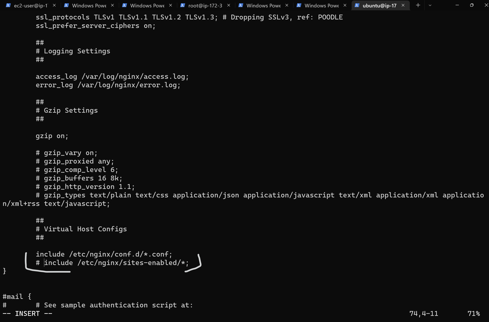

4. Restart Nginx.
```
sudo systemctl restart nginx
sudo systemctl status nginx
```
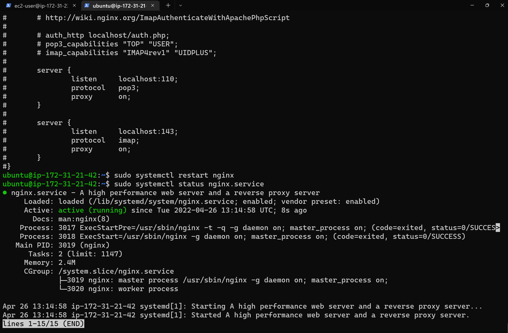

### PART 2 - REGISTER A NEW DOMAIN NAME AND CONFIGURE SECURED CONNECTION USING SSL/TLS CERTIFICATES

1. Register a new domain name with any registrar 

2. Assign an Elastic IP to Nginx LB server and associated domain name with the Elastic IP.

- Open the Amazon EC2 console at https://console.aws.amazon.com/ec2/.

- In the navigation pane, choose Elastic IPs.

- Select the Elastic IP address to associate and choose Actions, Associate Elastic IP address.

- For Resource type, choose Instance.

- For instance, choose the instance with which to associate the Elastic IP address. You can also enter text to search for a specific instance.

- (Optional) For Private IP address, specify a private IP address with which to associate the Elastic IP address.

- Choose Associate.

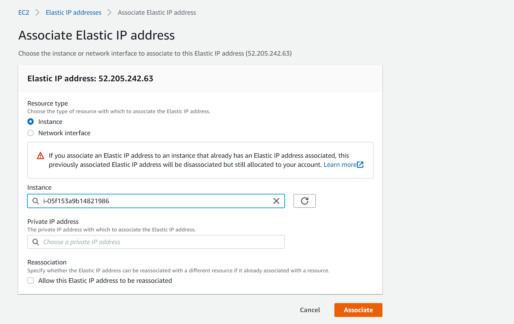

3. Update A record in your registrar to point to Nginx LB using Elastic IP address

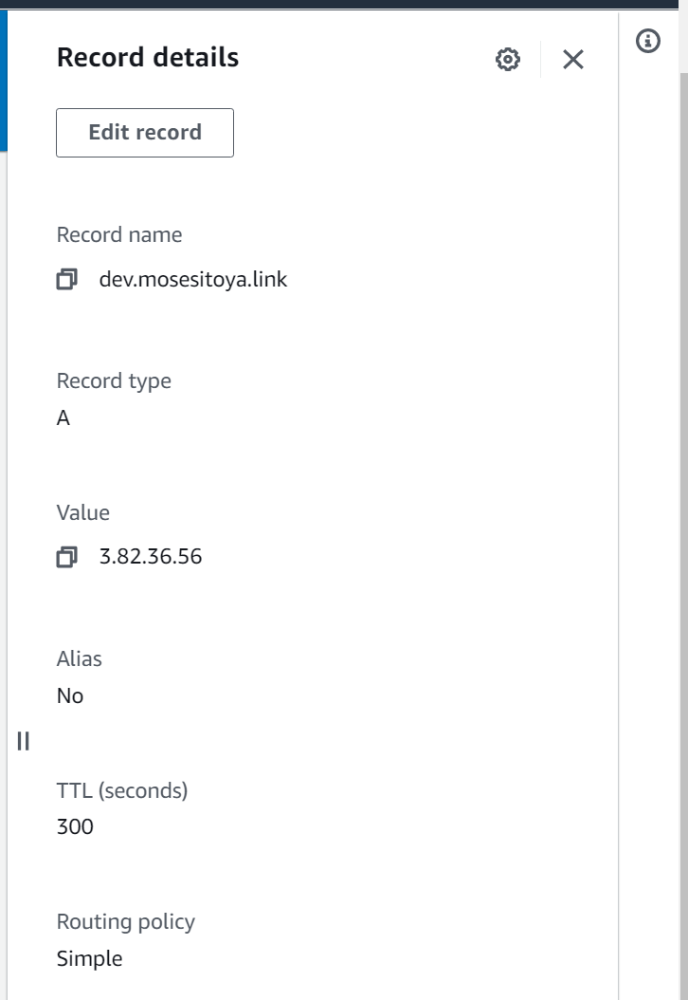

4. Configure Nginx to recognize the new domain name. This was done by Updating the /etc/nginx/nginx.conf file with 
```
server_name www.<your-domain-name.com>
```
 instead of *server_name www.domain.com*

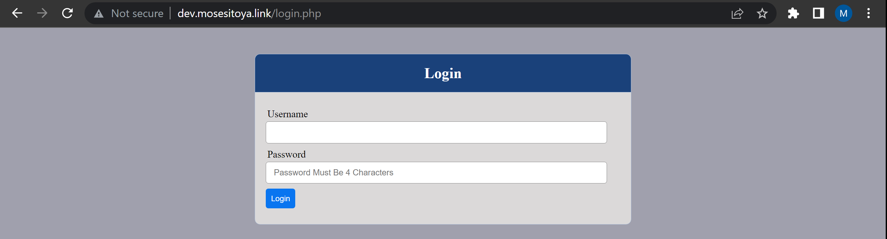

5. Install certbot and request for an SSL/TLS certificate for the domain name.
**N.B: Make sure snapd is running on the server.**
```
sudo systemctl status snapd
```

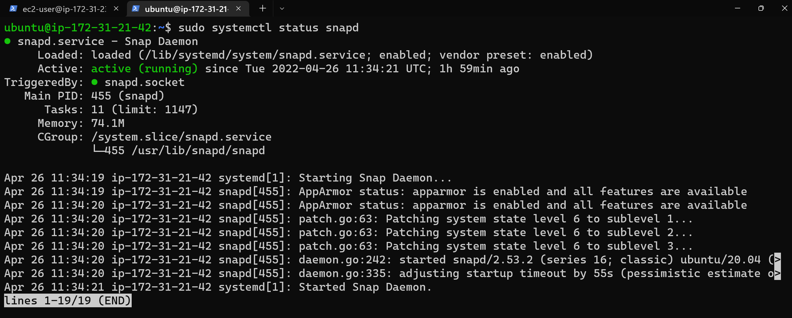

```
sudo snap install --classic certbot
```
6. Make a Request your certificate for the domain name.
```
sudo ln -s /snap/bin/certbot /usr/bin/certbot
sudo certbot --nginx
```

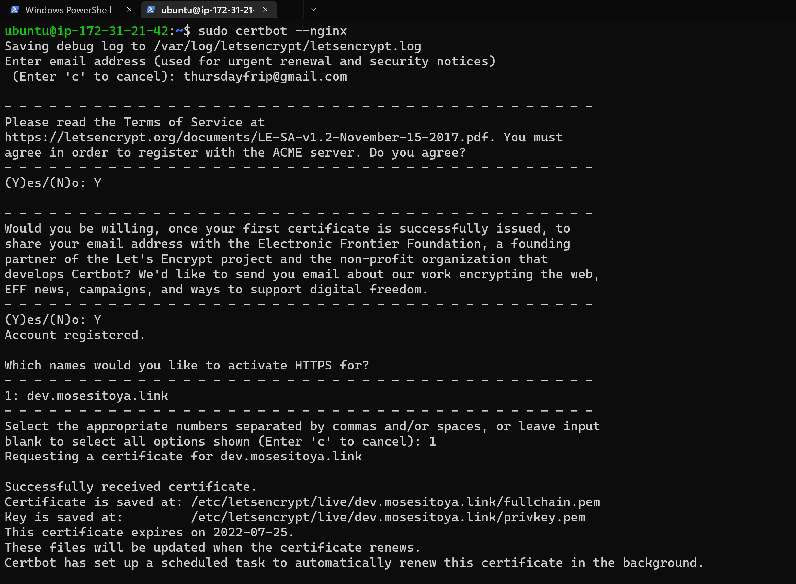

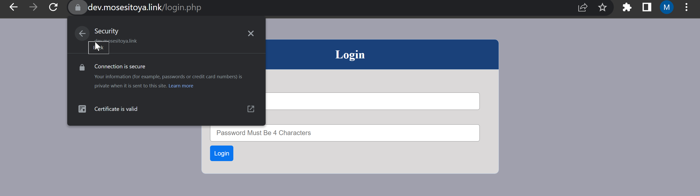

Follow the instruction displayed.

7. Lets Encrypt renews every 90 days and you can renew your certificate manually by running the following command.
```
sudo certbot renew --dry-run
```

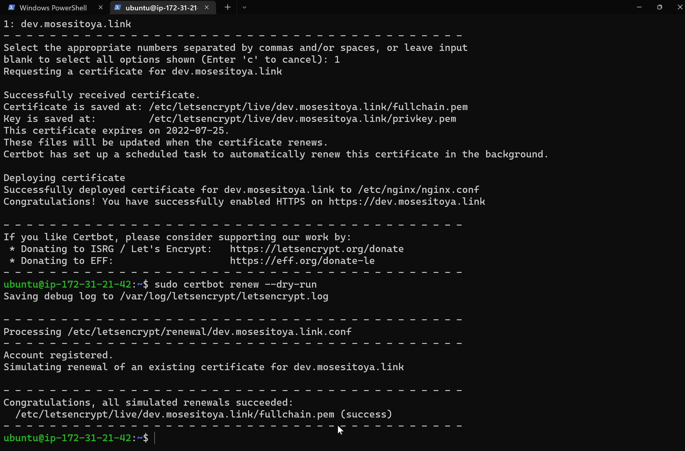

We can also create a cron job to do this same thing at a stipulated time. 

- Edit cron file
```
crontab -e
```
- Add the following line to the crontab file
```
5 */12 * */2 *   root /usr/bin/certbot renew > /dev/null 2>&1
```
- Save the crontab file