## WEB STACK IMPLEMENTATION (LAMP STACK) IN AWS

This is a step by step process on how I created a LAMP(Linux, Apache, MySql, PHP) stack.

Perequisite:
- An AWS account(free tier would be preferred as you basically pay for nothing to get through to the end of this project).
- A linux Terminal
- Some basic understanding of Linux, AWS EC2, Web Technology stack and VIM editor.

First things before the core Steps include:
- Spinning up an EC2 instance on your AWS account
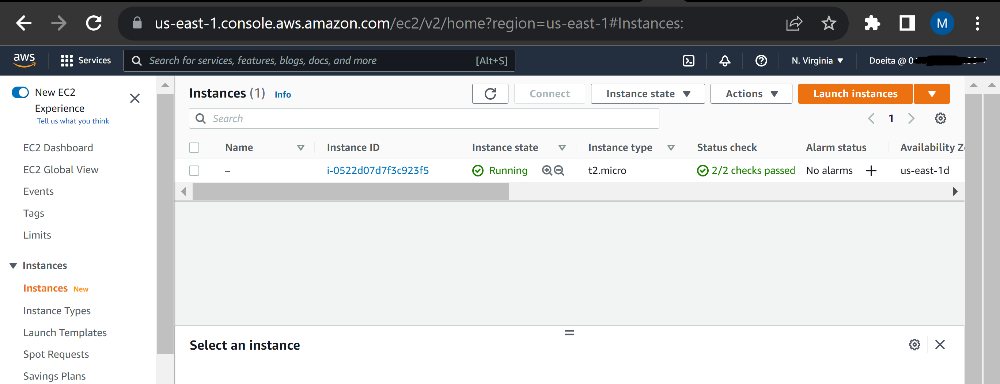
- SSH into your instance via your Linux Terminal -
You first have to change permissions for the private key using the command `sudo chmod 0400 <private-key-name>.pem` 
Next you connect to your instance via this command `ssh -i <private-key-name>.pem ubuntu@<Public-IP-address>`


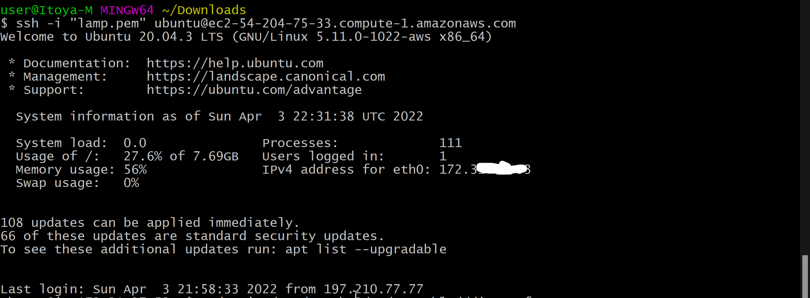

### STEP 1 — INSTALLING APACHE AND UPDATING THE FIREWALL
Install Apache using Ubuntu’s package manager ‘apt’

update a list of packages in package manager
`sudo apt update`

run apache2 package installation
`sudo apt install apache2`


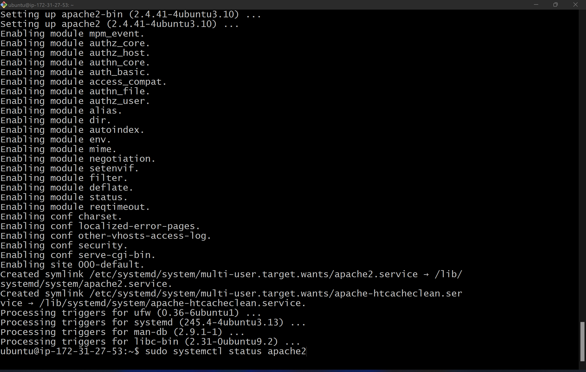

verify that apache2 is running as a Service in our OS
`sudo systemctl status apache2`

Add a rule to EC2 configuration to open inbound connection through port 80
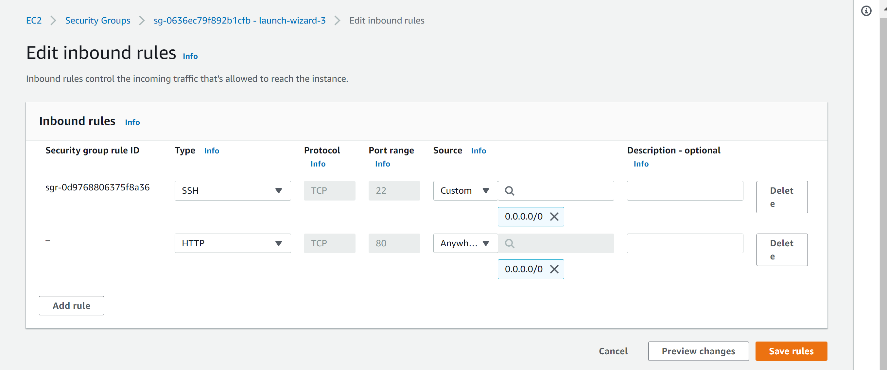

Our server is now running which we can confirm on our local machine by running `curl http://localhost:80`
or
 `curl http://127.0.0.1:80`


 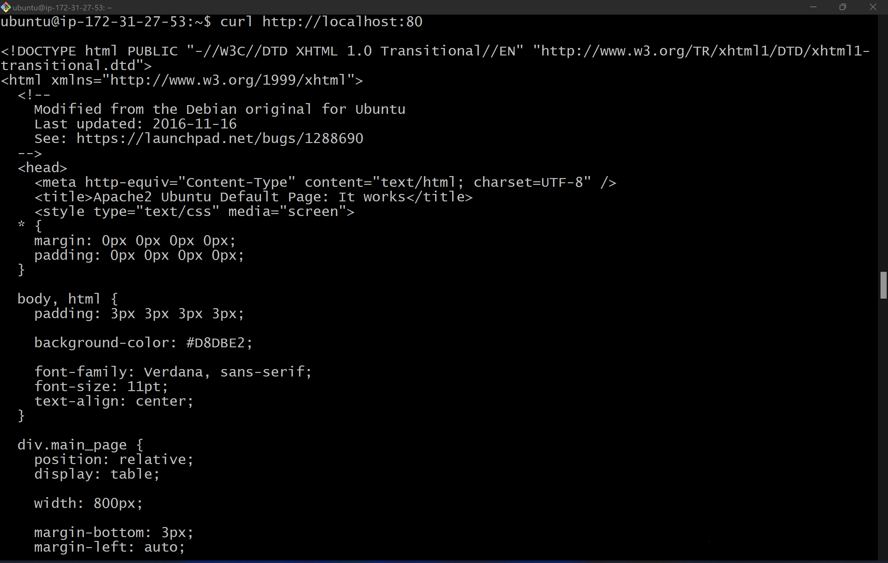

 Another way to test this is by running `http://<Public-IP-Address>:80` on the browser, Or Just `http://<Public-IP-Address>`


 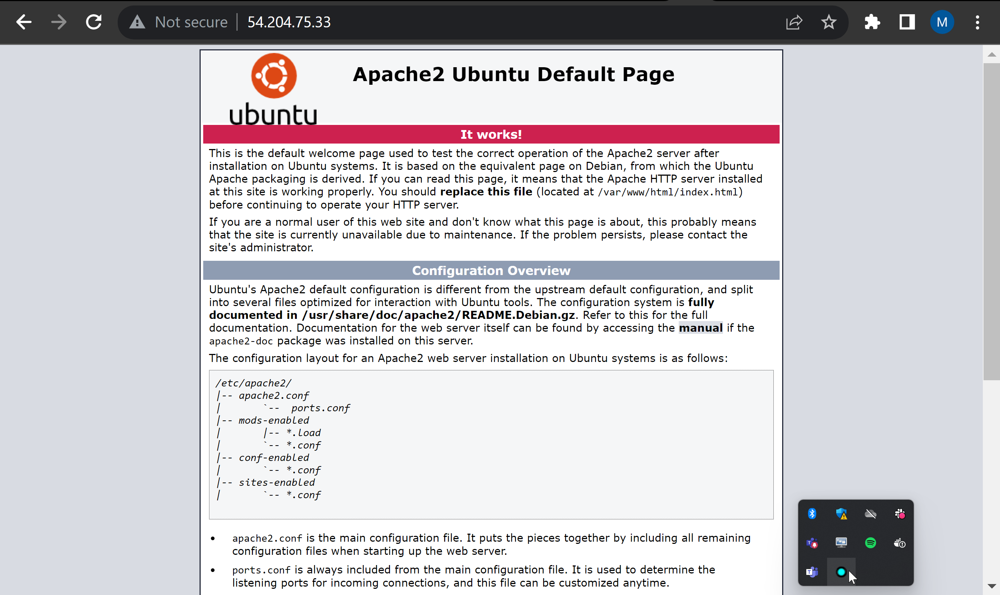

 ### STEP 2 — INSTALLING MYSQL

Use this command to run MySql Installation:
`sudo apt install mysql-server`

After installation, it is recommended to run a security script that comes pre-installed with MySQL. Use this command:
`sudo mysql_secure_installation`

On running this command, you`d get a couple of prompts, patiently follow through and youd should get something like this:


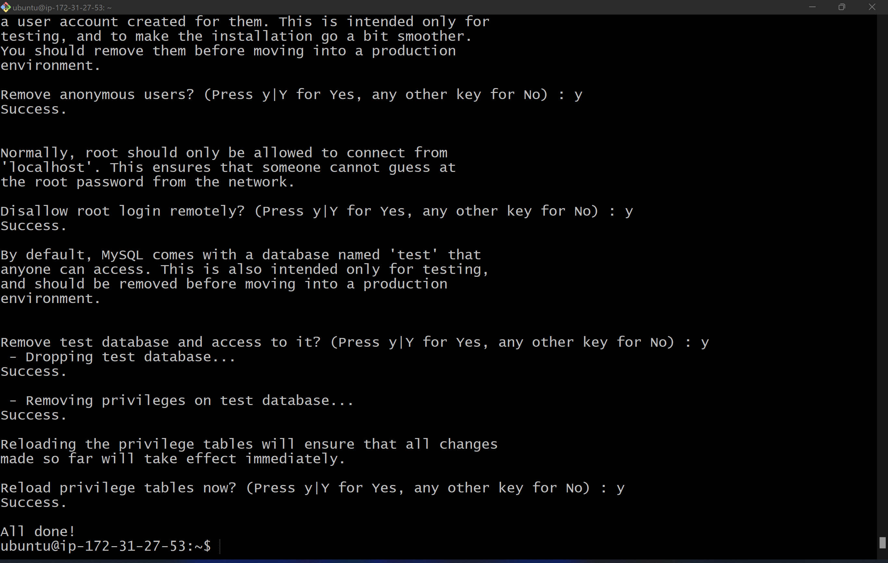

Test that all is set up correctly using `sudo mysql`. You should get an output like this:


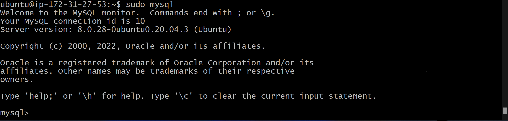


### STEP 3 — INSTALLING PHP

Run this command to instal the 3 Required Packages at once `sudo apt install php libapache2-mod-php php-mysql`


Run `php -v` to test all is as it should be


### STEP 4 — CREATING A VIRTUAL HOST FOR YOUR WEBSITE USING APACHE

Here, I was to set up a domain called projectlamp. I created a directory for projectlamp using: `sudo mkdir /var/www/projectlamp`. Next i changed ownership of the directory to my current user using `sudo chown -R $USER:$USER /var/www/projectlamp`. After that, i used Vim Editor to create and open a new configuration file in Apache’s sites-available directory, where i put this code in:

 ```
 <VirtualHost *:80>
    ServerName projectlamp
    ServerAlias www.projectlamp 
    ServerAdmin webmaster@localhost
    DocumentRoot /var/www/projectlamp
    ErrorLog ${APACHE_LOG_DIR}/error.log
    CustomLog ${APACHE_LOG_DIR}/access.log combined
</VirtualHost>
```


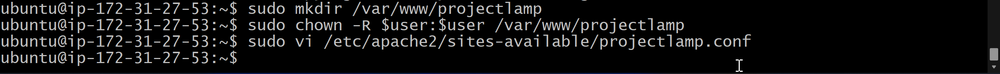

This shows the newly created config file


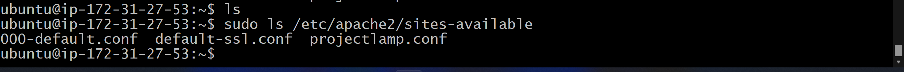

Enable the new virtual host using the a2ensite command:
`sudo a2ensite projectlamp`

Disable Apache’s default website
`sudo a2dissite 000-default`

Check for syntax Errors:
`sudo apache2ctl configtest`

Reload so changes take effect:
`sudo systemctl reload apache2`

Lastly


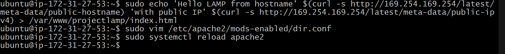

Access the website by it`s public DNS name or IP


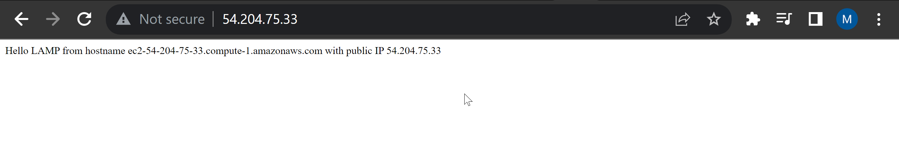


### STEP 5 — ENABLE PHP ON THE WEBSITE

Run `sudo vim /etc/apache2/mods-enabled/dir.conf`

and paste 

```
<IfModule mod_dir.c>
        #Change this:
        #DirectoryIndex index.html index.cgi index.pl index.php index.xhtml index.htm
        #To this:
        DirectoryIndex index.php index.html index.cgi index.pl index.xhtml index.htm
</IfModule>
```

`sudo systemctl reload apache2` To reload Apache so it takes effect

Create a new file named index.php inside your custom web root folder:

`vim /var/www/projectlamp/index.php` 

and paste this in:

`<?php
phpinfo();`

Save the file and reload the web page, you should see this:


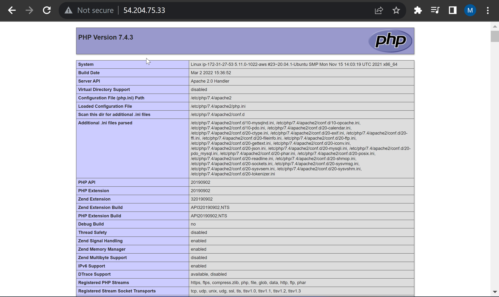

Remove the file you created as it contains sensitive information about your PHP environment -and your Ubuntu serve, Use: `sudo rm /var/www/projectlamp/index.php`
