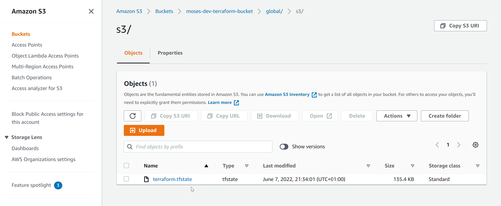
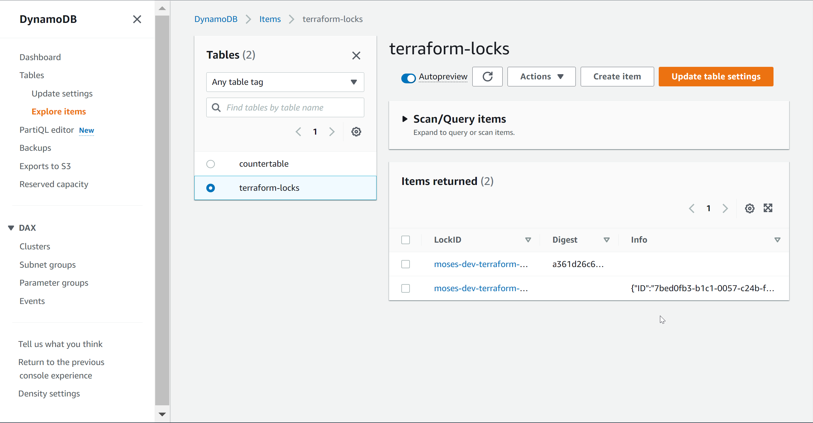
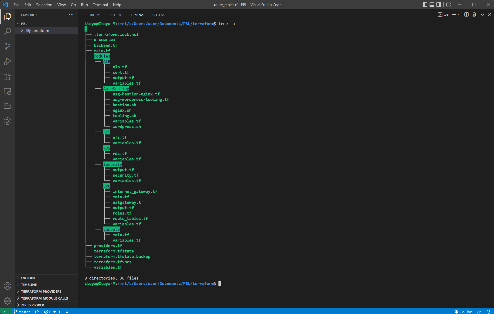

# AUTOMATE INFRASTRUCTURE WITH IAC USING TERRAFORM. PART 3 – REFACTORING

## Introducing Backend on S3
Each Terraform configuration can specify a backend, which defines where and how operations are performed, where state snapshots are stored, etc.
Take a peek into what the states file looks like. It is basically where terraform stores all the state of the infrastructure in json format.

Storing our tfstate file locally wont scale especially in a team environment. We need to find a way to store it in a place where other team members can access it. This is where S3 comes in.

Also wee need to implement state. Though it's optional but it's considered a good practice. This is because if we have multiple developers running at the same time, we need to ensure that only one of them is modifying the state file. We need DynamoDB to do this.

**Here is our plan to Re-initialize Terraform to use S3 backend:**

- Add S3 and DynamoDB resource blocks before deleting the local state file
- Update terraform block to introduce backend and locking
- Re-initialize terraform
- Delete the local tfstate file and check the one in S3 bucket
- Add outputs
- terraform apply

1. Create backend.tf and add the following:
```
# Note: The bucket name may not work for you since buckets are unique globally in AWS, so you must give it a unique name.
resource "aws_s3_bucket" "terraform_state" {
  bucket = "moses-dev-terraform-bucket"
  # Enable versioning so we can see the full revision history of our state files
  versioning {
    enabled = true
  }
  # Enable server-side encryption by default
  server_side_encryption_configuration {
    rule {
      apply_server_side_encryption_by_default {
        sse_algorithm = "AES256"
      }
    }
  }
}
```

We used server-side encryption to ensure that our state files are encrypted since the state files stores sensitive information like passwords.


2. Create DynamoDB table to handle locking. With a cloud storage database like DynamoDB, anyone running Terraform against the same infrastructure can use a central location to control a situation where Terraform is running at the same time from multiple different people.

```
resource "aws_dynamodb_table" "terraform_locks" {
  name         = "terraform-locks"
  billing_mode = "PAY_PER_REQUEST"
  hash_key     = "LockID"
  attribute {
    name = "LockID"
    type = "S"s
  }
}

```
***Terraform expects that both S3 bucket and DynamoDB resources are already created before we configure the backend. So, let us run ```terraform apply``` to provision resources.***

3. Configure S3 backend.
```
terraform {
  backend "s3" {
    bucket         = "moses-dev-terraform-bucket"
    key            = "global/s3/terraform.tfstate"
    region         = "us-east-1"
    dynamodb_table = "terraform-locks"
    encrypt        = true
  }
}

```

Now, Run ```terraform init``` and confirm you are happy to change the backend by typing ```yes```

4. Verify the changes
Checking AWS, the followings will be noted:

- tfstatefile is now inside the S3 bucket


- DynamoDB table which we create has an entry which includes state file status


5. Add Terraform Output

Add the following to output.tf
```
output "s3_bucket_arn" {
  value       = aws_s3_bucket.terraform_state.arn
  description = "The ARN of the S3 bucket"
}
output "dynamodb_table_name" {
  value       = aws_dynamodb_table.terraform_locks.name
  description = "The name of the DynamoDB table"
}
```

6. Run ```terraform apply```

Terraform will automatically read the latest state from the S3 bucket to determine the current state of the infrastructure. Even if another engineer has applied changes, the state file will always be up to date.

Check the tfstate file in S3 and click the version tab to see the different versions of the tfstate file.


## WHEN TO USE WORKSPACES OR DIRECTORY?
To separate environments with significant configuration differences, use a directory structure. Use workspaces for environments that do not greatly deviate from each other, to avoid duplication of your configurations. 


## Using Dynamic Block

For repetitive blocks of code you can use dynamic blocks in Terraform. [Watch video](https://www.youtube.com/watch?v=tL58Qt-RGHY&feature=youtu.be)

Refactor Security Groups creation with dynamic blocks.
```security.tf```

```
# security group for alb, to allow acess from any where for HTTP and HTTPS traffic
resource "aws_security_group" "ext-alb-sg" {
  name        = "ext-alb-sg"
  vpc_id      = var.vpc_id
  description = "Allow TLS inbound traffic"

  ingress {
    description = "HTTP"
    from_port   = 80
    to_port     = 80
    protocol    = "tcp"
    cidr_blocks = ["0.0.0.0/0"]
  }

  ingress {
    description = "HTTPS"
    from_port   = 22
    to_port     = 22
    protocol    = "tcp"
    cidr_blocks = ["0.0.0.0/0"]
  }

  egress {
    from_port   = 0
    to_port     = 0
    protocol    = "-1"
    cidr_blocks = ["0.0.0.0/0"]
  }

 tags = merge(
    var.tags,
    {
      Name = "ext-alb-sg"
    },
  )

}

# security group for bastion, to allow access into the bastion host from you IP
resource "aws_security_group" "bastion-sg" {
  name        = "bastion-sg"
  vpc_id = var.vpc_id
  description = "Allow incoming HTTP connections."

  ingress {
    description = "SSH"
    from_port   = 22
    to_port     = 22
    protocol    = "tcp"
    cidr_blocks = ["0.0.0.0/0"]
  }

  egress {
    from_port   = 0
    to_port     = 0
    protocol    = "-1"
    cidr_blocks = ["0.0.0.0/0"]
  }

   tags = merge(
    var.tags,
    {
      Name = "bastion-sg"
    },
  )
}

#security group for nginx reverse proxy, to allow access only from the extaernal load balancer and bastion instance
resource "aws_security_group" "nginx-sg" {
  name   = "nginx-sg"
  vpc_id = var.vpc_id

  egress {
    from_port   = 0
    to_port     = 0
    protocol    = "-1"
    cidr_blocks = ["0.0.0.0/0"]
  }

   tags = merge(
    var.tags,
    {
      Name = "nginx-SG"
    },
  )
}

resource "aws_security_group_rule" "inbound-nginx-http" {
  type                     = "ingress"
  from_port                = 443
  to_port                  = 443
  protocol                 = "tcp"
  source_security_group_id = aws_security_group.ext-alb-sg.id
  security_group_id        = aws_security_group.nginx-sg.id
}

resource "aws_security_group_rule" "inbound-bastion-ssh" {
  type                     = "ingress"
  from_port                = 22
  to_port                  = 22
  protocol                 = "tcp"
  source_security_group_id = aws_security_group.bastion-sg.id
  security_group_id        = aws_security_group.nginx-sg.id
}

# security group for ialb, to have acces only from nginx reverser proxy server
resource "aws_security_group" "int-alb-sg" {
  name   = "int-alb-sg"
  vpc_id = var.vpc_id

  egress {
    from_port   = 0
    to_port     = 0
    protocol    = "-1"
    cidr_blocks = ["0.0.0.0/0"]
  }

  tags = merge(
    var.tags,
    {
      Name = "int-alb-sg"
    },
  )

}

resource "aws_security_group_rule" "inbound-ialb-https" {
  type                     = "ingress"
  from_port                = 443
  to_port                  = 443
  protocol                 = "tcp"
  source_security_group_id = aws_security_group.nginx-sg.id
  security_group_id        = aws_security_group.int-alb-sg.id
}

# security group for webservers, to have access only from the internal load balancer and bastion instance
resource "aws_security_group" "webserver-sg" {
  name   = "webserver-sg"
  vpc_id = var.vpc_id

  egress {
    from_port   = 0
    to_port     = 0
    protocol    = "-1"
    cidr_blocks = ["0.0.0.0/0"]
  }

  tags = merge(
    var.tags,
    {
      Name = "webserver-sg"
    },
  )

}

resource "aws_security_group_rule" "inbound-web-https" {
  type                     = "ingress"
  from_port                = 443
  to_port                  = 443
  protocol                 = "tcp"
  source_security_group_id = aws_security_group.int-alb-sg.id
  security_group_id        = aws_security_group.webserver-sg.id
}

resource "aws_security_group_rule" "inbound-web-ssh" {
  type                     = "ingress"
  from_port                = 22
  to_port                  = 22
  protocol                 = "tcp"
  source_security_group_id = aws_security_group.bastion-sg.id
  security_group_id        = aws_security_group.webserver-sg.id
}

# security group for datalayer to alow traffic from websever on nfs and mysql port and bastiopn host on mysql port
resource "aws_security_group" "datalayer-sg" {
  name   = "datalayer-sg"
  vpc_id = var.vpc_id

  egress {
    from_port   = 0
    to_port     = 0
    protocol    = "-1"
    cidr_blocks = ["0.0.0.0/0"]
  }

 tags = merge(
    var.tags,
    {
      Name = "datalayer-sg"
    },
  )
}

resource "aws_security_group_rule" "inbound-nfs-port" {
  type                     = "ingress"
  from_port                = 2049
  to_port                  = 2049
  protocol                 = "tcp"
  source_security_group_id = aws_security_group.webserver-sg.id
  security_group_id        = aws_security_group.datalayer-sg.id
}

resource "aws_security_group_rule" "inbound-mysql-bastion" {
  type                     = "ingress"
  from_port                = 3306
  to_port                  = 3306
  protocol                 = "tcp"
  source_security_group_id = aws_security_group.bastion-sg.id
  security_group_id        = aws_security_group.datalayer-sg.id
}

resource "aws_security_group_rule" "inbound-mysql-webserver" {
  type                     = "ingress"
  from_port                = 3306
  to_port                  = 3306
  protocol                 = "tcp"
  source_security_group_id = aws_security_group.webserver-sg.id
  security_group_id        = aws_security_group.datalayer-sg.id
}

```

## EC2 refactoring with Map and Lookup

Map uses a key and value pairs as a data structure that can be set as a default type for variables. e.g

```
variable "images" {
    type = "map"
    default = {
        us-east-1 = "image-1234"
        us-west-2 = "image-23834"
    }
}

```
To select an appropriate AMI per region, we will use a lookup function which has following syntax: ```lookup(map, key, [default])```.

**NOTE:** Its adviced to use a map with a default value for the lookup function.

To use the lookup function, we will use the following syntax:
```
resource "aws_instace" "web" {
    ami  = lookup(var.images, var.region, "ami-12323")
}

```
Var.images is the map used to lookup the value.

var.region is the key used to lookup the value.

ami-12323 is the default value if the key is not found in the map.


## Conditional Expressions

These are used to make decisions and choose between resources based on the condition.

In general, the syntax is as following: ```condition ? true_val : false_val``` e.g

```
resource "aws_db_instance" "read_replica" {
  count               = var.create_read_replica == true ? 1 : 0
  replicate_source_db = aws_db_instance.this.id
}
```


## Terraform Modules

To work with best practice it is important to write reusable code. And in line with thatterraform provides us with a tool called Terraform Module.

Modules serve as containers that allow to logically group Terraform codes for similar resources in the same domain (e.g., Compute, Networking, AMI, etc.). One root module can call other child modules and insert their configurations when applying Terraform config. This concept makes your code structure neater, and it allows different team members to work on different parts of configuration at the same time.

You can refer to existing child modules from your root module by specifying them as a source, like this:
```
module "child_module" {
  source = "./modules/child_module"
}
```

You can also directly access resource outputs from the modules, like this:

```
resource "aws_elb" "example" {
  # ...

  instances = module.servers.instance_ids
}


# module ‘servers’ has to have output file to expose variables for this resource.
```


## REFACTOR YOUR PROJECT USING MODULES

We will seperate all the teraform code into modules following these setup:

```
- modules
  - ALB: For Apllication Load balancer and similar resources
  - EFS: For Elastic file system resources
  - RDS: For Databases resources
  - Autoscaling: For Autosacling and launch template resources
  - compute: For EC2 and rlated resources
  - VPC: For VPC and netowrking resources such as subnets, roles, e.t.c.
  - security: for creating security group resources

```

We will create a Modules Folder and create other folders inside it for the different seperation of concerns.

Each Modules e.g will have its own main.tf or resource-name.tf, and each module will have its own variables.tf and outputs.tf.




## Tips:

- You can validate your codes before running terraform plan with terraform validate command. It will check if your code is syntactically valid and internally consistent.

- In order to make your configuration files more readable and follow canonical format and style – use `terraform fmt command`. It will apply Terraform language style conventions and format your .tf files in accordance to them.

[HERE IS A LINK TO MY REPO FOR THIS PROJECT](https://github.com/royalt1234/terrafrom-prj18-code.git)