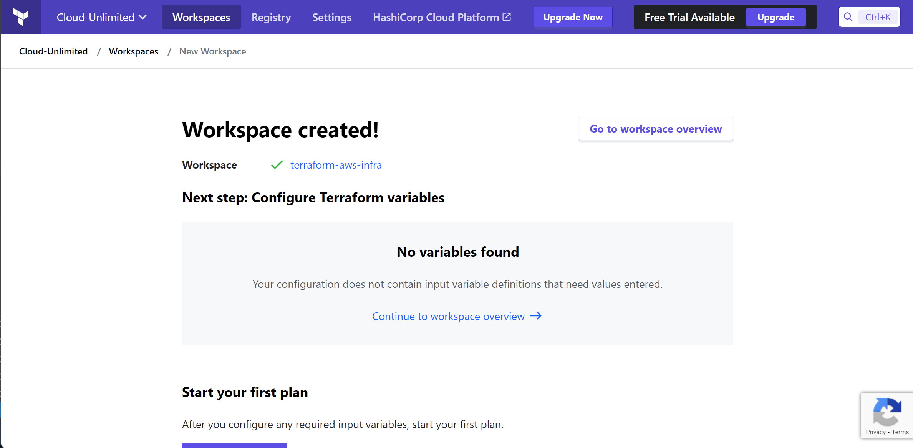
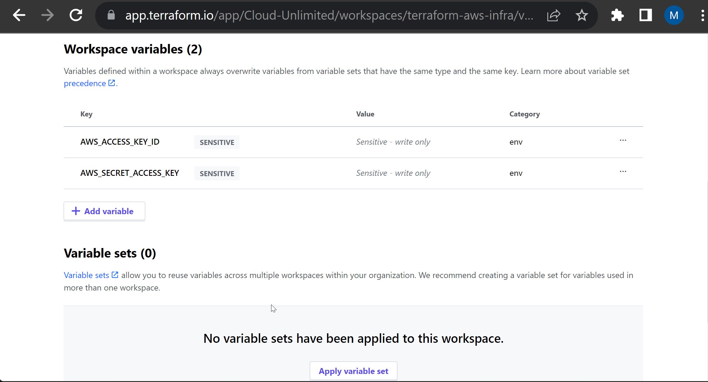
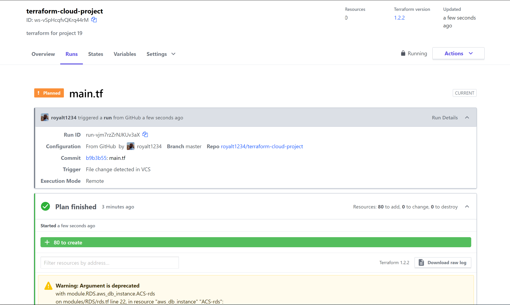
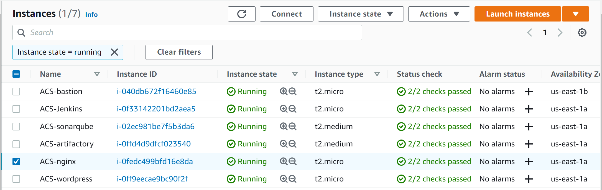
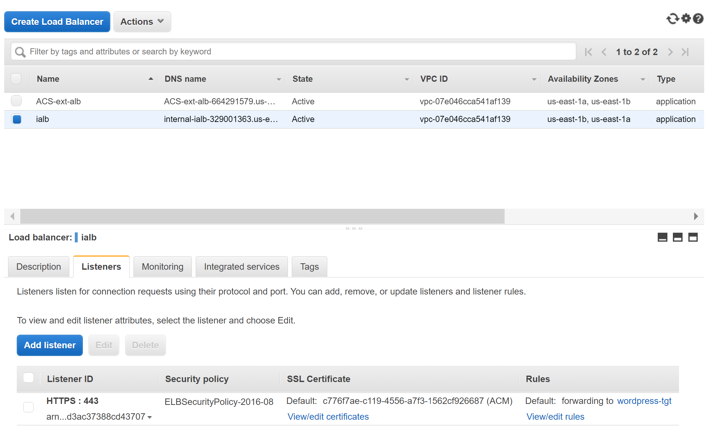
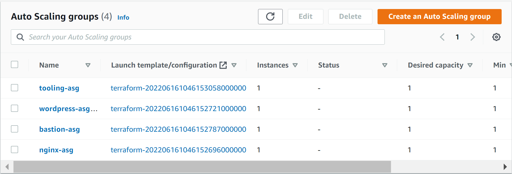
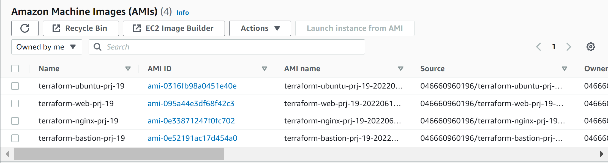
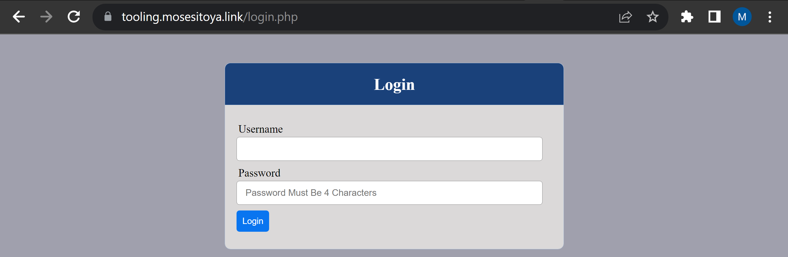
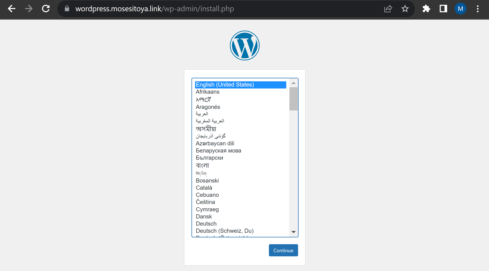

## Automate Infrastructure With IaC using Terraform. Part 4 – Terraform Cloud

### Migrate your .tf codes to Terraform Cloud

1. Create a Terraform Cloud account - Follow this [link](https://app.terraform.io/signup/account), create a new account, verify your email. Most of the features are free, but if you want to explore the difference between free and paid plans – you can check it on this [page](https://www.hashicorp.com/products/terraform/pricing).

2. Create an organization. Select "Start from scratch", choose a name for your organization and create it.

3. Configure a workspace. Chose version control workflow to run Terraform commands triggered from our git repository.

4. Create a new repository in your GitHub and call it terraform-cloud(or whatever you like), push the current Terraform codes we have been developing from project 16 to the repository.

5. Choose version control workflow and you will be prompted to connect your GitHub account to your workspace – follow the prompt and add your newly created repository to the workspace.

6. Move on to "Configure settings", provide a description for your workspace and leave all the rest settings default, click "Create workspace".

7. Configure variables - Terraform Cloud supports two types of variables: environment variables and Terraform variables. Either type can be marked as sensitive, which prevents them from being displayed in the Terraform Cloud web UI and makes them write-only. Set two environment variables: `AWS_ACCESS_KEY_ID` and `AWS_SECRET_ACCESS_KEY`, set the values that you used in Project 16. These credentials will be used to privision your AWS infrastructure by Terraform Cloud.

8. Add the AMI files for building packer images and the Ansible scripts to configure the infrastucture. Before you proceed ensure you have the following tools installed on your local machine;

* packer
* Ansible

9. Run `terraform plan` and `terraform apply` from web console. Switch to "Runs" tab and click on "Queue plan manualy" button. If planning has been successfull, you can proceed and confirm Apply – press "Confirm and apply", provide a comment and "Confirm plan"

10. Check the logs and verify that everything has run correctly. Note that Terraform Cloud has generated a unique state version that you can open and see the codes applied and the changes made since the last run.

11. Test automated terraform plan
By now, you have tried to launch plan and apply manually from Terraform Cloud web console. But since we have an integration with GitHub, the process can be triggered automatically. Try to change something in any of .tf files and look at "Runs" tab again – plan must be launched automatically, but to apply you still need to approve manually.
