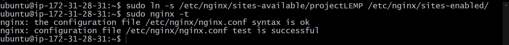
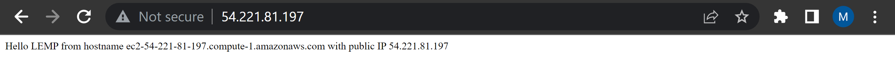
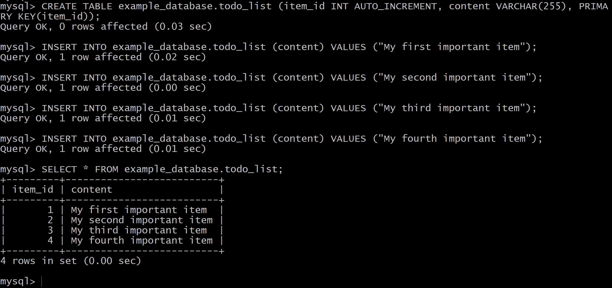

## WEB STACK IMPLEMENTATION (LEMP STACK)

On project 1, we implemented LAMP web stack. Here, we would be implementing the LEMP(Linux, Nginx, MySQL, PHP) Web Stack. Familiarity with SQL syntax and Nano editor would be beneficial. Create an EC2 instance on AWS, open TCP port 80 so web browsers can access web pages via the Internet, ssh in.


### STEP 1 – INSTALLING THE NGINX WEB SERVER

Update the server package index with `sudo apt update` and install Nginx `sudo apt install nginx`.

Check that nginx was successfully installed and is running as a service in Ubuntu, run:
`sudo systemctl status nginx`


You can access the server locally by, run: `curl http://127.0.0.1:80` or via the internet using the url `http://Public-IP-Address:80` 


### STEP 2 — INSTALLING MYSQL

Install MySQL Software, run `sudo apt install mysql-server`

After installation, it’s recommended that you run a security script that comes pre-installed with MySQL:
`sudo mysql_secure_installation`  
follow the prompt, set password then run `sudo mysql` to test you are able to login to the MySQL.


Exit the MySQL console: `mysql> exit`


### STEP 3 – INSTALLING PHP

Install the PHP fastCGI process manager and PHP-MYSQL module, run:
`sudo apt install php-fpm php-mysql`

When prompted, type Y and press ENTER to confirm installation.


### STEP 4 — CONFIGURING NGINX TO USE PHP PROCESSOR

Create the root web directory for your_domain, run: `sudo mkdir /var/www/projectLEMP`

Change ownership of the root web directory: `sudo chown -R $USER:$USER /var/www/projectLEMP`

Open a new configuration file in Nginx’s sites-available directory using nano: `sudo nano /etc/nginx/sites-available/projectLEMP`

Paste in the following bare-bones configuration:
```
#/etc/nginx/sites-available/projectLEMP

server {
    listen 80;
    server_name projectLEMP www.projectLEMP;
    root /var/www/projectLEMP;

    index index.html index.htm index.php;

    location / {
        try_files $uri $uri/ =404;
    }

    location ~ \.php$ {
        include snippets/fastcgi-php.conf;
        fastcgi_pass unix:/var/run/php/php7.4-fpm.sock;
     }

    location ~ /\.ht {
        deny all;
    }

}
```


Activate your configuration by linking to the config file from Nginx’s sites-enabled directory:

`sudo ln -s /etc/nginx/sites-available/projectLEMP /etc/nginx/sites-enabled/`

Test your configuration for syntax errors
`sudo nginx -t`




Disable default Nginx host that is currently configured to listen on port 80:
`sudo unlink /etc/nginx/sites-enabled/default` 

Reload Nginx to apply the changes:
`sudo systemctl reload nginx`

Your new website is now active, but the web root /var/www/projectLEMP is still empty. Create an index.html file in that location so that we can test that your new server block works as expected:

`sudo echo 'Hello LEMP from hostname' $(curl -s http://169.254.169.254/latest/meta-data/public-hostname) 'with public IP' $(curl -s http://169.254.169.254/latest/meta-data/public-ipv4) > /var/www/projectLEMP/index.html`





### STEP 5 – TESTING PHP WITH NGINX

Test it to validate that Nginx can correctly hand .php files off to your PHP processor: 
`sudo nano /var/www/projectLEMP/info.php`


Access this page in your web browser by visiting the domain name or public IP address you’ve set up in your Nginx configuration file, followed by /info.php:
`http://server_domain_or_IP/info.php`


 Remove the file you created as it contains sensitive information about your PHP environment and your Ubuntu server. You can use rm to remove that file:
`sudo rm /var/www/your_domain/info.php`


### STEP 6 – RETRIEVING DATA FROM MYSQL DATABASE WITH PHP (CONTINUED)

Connect to the MySQL console using the root account: `sudo mysql`


Create a new database from your MySQL console: `mysql> CREATE DATABASE `example_database`;`

Create a new user and grant him full privileges on the just created database:
`mysql>  CREATE USER 'example_user'@'%' IDENTIFIED WITH mysql_native_password BY 'password';`


Give this user permission over the example_database database:

`mysql> GRANT ALL ON example_database.* TO 'example_user'@'%';`


Exit the MySQL console: 

`mysql> exit`

Test if the new user has the proper permissions by logging in to the MySQL console again, this time using the custom user credentials:

`mysql -u example_user -p`


Confirm that you have access to the example_database database:

`mysql> SHOW DATABASES;`


Create a test table named todo_list. From the MySQL console, run the following statement:

`CREATE TABLE example_database.todo_list ( item_id INT AUTO_INCREMENT, content VARCHAR(255), PRIMARY KEY(item_id));`


Insert a few rows of content in the test table. You might want to repeat the next command a few times, using different VALUES:

`mysql> INSERT INTO example_database.todo_list (content) VALUES ("My first important item");`


Confirm that the data was successfully saved to your table:

`mysql>  SELECT * FROM example_database.todo_list;`
You’ll see the following output:



Exit the MySQL console:

`mysql> exit`


Create a PHP script that will connect to MySQL and query for your content using Nano editor


Save and close the file when you are done editing.

You can now access this page in your web browser by visiting the domain name or public IP address configured for your website, followed by /todo_list.php:

`http://<Public_domain_or_IP>/todo_list.php`

