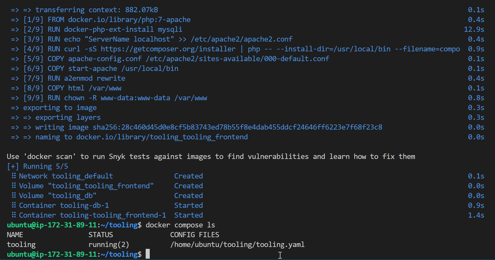

# MIGRATION TO THE CLOUD AND CONTAINERIZATION PART 1: DOCKER AND DOCKER COMPOSE

## Install Docker
- Run this command
  ```
  curl -fsSL https://get.docker.com -o get-docker.sh
  sh ./get-docker.sh
  usermod -aG docker ubuntu
  ```
I wrote an article about running docker without sudo, you can check it out [here]()

## MySQL in Container
- Pull MySQL Docker image from Docker Hub
  ```
  docker pull mysql/mysql-server:latest
  ```
    
  list the images you have on your instance `docker image ls`

- Deploy the MySQL Container
  ```
  docker run --name <container_name> -e MYSQL_ROOT_PASSWORD=<my-secret-pw> -d mysql/mysql-server:latest
  ```
  
  Run `docker ps -a` to see all your containers (running or stopped)
    

## Connecting to the MySQL Docker container
- Approach 1
  ```
  docker exec -it mysql bash
  ```
  or

  ```
  docker exec -it  mysql -u root -p
  ```
    
- Approach 2
  - Create a network
    ```
    docker network create --subnet=172.18.0.0/24 tooling_app_network
    ```
  - Export an environment variable containing the root password setup earlier
    ```
    export MYSQL_PW=<my-secret-pw>
    ```
  - Run the container using the network created
    ```
    docker run --network tooling_app_network -h mysqlserverhost --name=mysql-server -e MYSQL_ROOT_PASSWORD=$MYSQL_PW  -d mysql/mysql-server:latest
    ```
  - Verify the container is running `docker ps -a`
- Create a MySQL user using a script
  - Create a **create_user.sql** file and paste in the following
    ```
    CREATE USER ''@'%' IDENTIFIED BY ''; GRANT ALL PRIVILEGES ON * . * TO ''@'%';
    ```
  - Run the script
    ```
    docker exec -i mysql-server mysql -uroot -p$MYSQL_PW < create_user.sql
    ```

- Run the MySQL client container
  ```
  docker run --network tooling_app_network --name mysql-client -it --rm mysql mysql -h mysqlserverhost -u  -p 
  ```
  

## Prepare Database Schema
- Clone the Tooling app repository
  ```
  git clone https://github.com/darey-devops/tooling.git
  ```
- Export the location of the SQL file
  ```
  export tooling_db_schema=./tooling/html/tooling_db_schema.sql
  ```
- Use the script to create the database and prepare the schema
  ```
  docker exec -i mysql-server mysql -u root -p $MYSQL_PW < $tooling_db_schema
  ```
- Using vim editor, Update .env file located in `tooling/html/.env` with database information
  ```
   MYSQL_IP=mysqlserverhost
   MYSQL_USER=username
   MYSQL_PASS=client-secrete-password
   MYSQL_DBNAME=toolingdb
   ```
- Run the Tooling app
  - First build the Docker image. Cd into the tooling folder, where the Dockerfile is and run
    ```
    docker build -t tooling:0.0.1 .
    ```
    
  - Run the container
    ```
    docker run --network tooling_app_network -p 8085:80 -it tooling:0.0.1
    ```
    
## Practice Task 1
### Implement a POC to migrate the PHP-Todo app into a containerized application.
### Part 1
- Clone the php-todo repo here: https://github.com/royalt1234/php-todo-for-docker.git 
- Write a Dockerfile for the TODO application
```
FROM php:7.4.30-cli
USER root
WORKDIR  /var/www/html

RUN apt-get update && apt-get install -y \
    libpng-dev \
    zlib1g-dev \
    libxml2-dev \
    libzip-dev \
    libonig-dev \
    zip \
    curl \
    unzip \
    && docker-php-ext-configure gd \
    && docker-php-ext-install -j$(nproc) gd \
    && docker-php-ext-install pdo_mysql \
    && docker-php-ext-install mysqli \
    && docker-php-ext-install zip \
    && docker-php-source delete

COPY . .

RUN curl -sS https://getcomposer.org/installer | php -- --install-dir=/usr/local/bin --filename=composer

ENTRYPOINT [  "bash", "start-apache.sh" ]
```

- Run both database and app on your Docker Engine
    
  
- Access the application from the browser
    
 
### Part 2
- Create an account on Docker Hub
  
- Create a Docker Hub repository
  
- Push the docker images from the instance to Docker Hub
  - First run `docker login` and enter your docker credentials.
  - Then retag your image and push:
    ```
    docker tag <tag> <repo-name>/<tag>
    docker push <repo-name>/<tag>
    ```

### Part 3
- Write a Jenkinsfile for Docker build and push to registry
- Connect the repo to Jenkins (using Blue Ocean plugin)
- Create a multibranch pipeline
- Simulate a Docker push
 
- Verify the images can be found in the registry
    
    

### Deployment with Docker Compose
- Install Docker Compose (https://docs.docker.com/compose/install/)
- Create a file, `tooling.yaml` and paste in the following block
  ```
  version: "3.9"
  services:
  tooling_frontend:
    build: .
    ports:
      - "5000:80"
    volumes:
      - tooling_frontend:/var/www/html
    links:
      - db
  db:
    image: mysql:5.7
    restart: always
    environment:
      MYSQL_DATABASE: <The database name required by Tooling app >
      MYSQL_USER: <The user required by Tooling app >
      MYSQL_PASSWORD: <The password required by Tooling app >
      MYSQL_RANDOM_ROOT_PASSWORD: '1'
    volumes:
      - db:/var/lib/mysql
  volumes:
    tooling_frontend:
    db:
    ```
- Run the command `docker-compose -f tooling.yaml up -d` to start the containers.
- Verify the containers are running `docker-compose -f tooling.yaml ps`
    

## Practice Task 2
### 1. Document understanding of the various fields in `tooling.yaml`
- version: "3.9" specifies the version of the docker-compose API 
- services: defines configurations that are applied to containers when `docker-compose up` is run. 
  - tooling_frontend specifies the name of the first service.
  - build tells docker-compose that it needs to build and image from a Dockerfile for this service.
  - ports attaches port 5000 on the instance to port 80 on the container
  - volumes attaches a path on the host instance to any container created for the service
  - links connects one container to another (tooling_frontend to db in this case)
  - db defines the database service (can be any name)
  - image specifies the image to use for the containers, if it isn't available on the instance, it is pulled from Docker Hub
  - restart tells the container how frequently to restart
  - environment is used to pass environment variables required for the service running in the container

    
    

Link to php-todo repo: https://github.com/royalt1234/php-todo-for-docker.git
