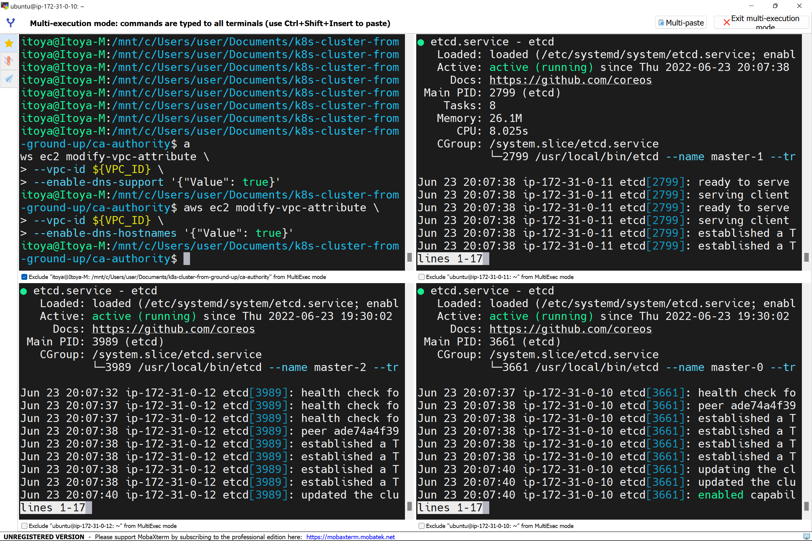
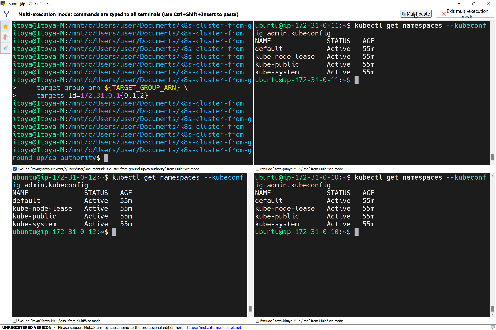

# K8s From Grounds Up


## Install Client Tools
Tools:
- awscli: Tool used to manage AWS resources
  ```
  Installation: https://aws.amazon.com/cli/
  ```
- kubectl: Used to manage K8s cluster
  ```
  wget https://storage.googleapis.com/kubernetes-release/release/v1.21.0/bin/linux/amd64/kubectl
  chmod +x kubectl
  sudo mv kubectl /usr/local/bin/
  kubectl version --client
  ```
- cfssl: an open source toolkit for everything TLS/SSL from Cloudflare
- cfssljson – a program, which takes the JSON output from the cfssl and writes certificates, keys, CSRs, and bundles to disk.
  ```
  wget -q --show-progress --https-only --timestamping \
  https://storage.googleapis.com/kubernetes-the-hard-way/cfssl/1.4.1/linux/cfssl \
  https://storage.googleapis.com/kubernetes-the-hard-way/cfssl/1.4.1/linux/cfssljson
  chmod +x cfssl cfssljson
  sudo mv cfssl cfssljson /usr/local/bin/
  ```

## AWS Resources for K8s Cluster
- VPC (172.31.0.0/16 CIDR block)
  - Enable DNS support
  - Enable DNS hostnames
  - DHCP option sets
  - Subnet (172.31.0.0/24 CIDR block)
  - Internet Gateway
  - Route table with route to the internet gateway
  - Security groups
    - Allow ports 2379-2380 from within the subnet
    - Allow ports 30000-32767 from anywhere (to access cluster services)
    - Allow port 6443 for K8s API server
    - Allow SSH connection from anywhere
    - Allow ICMP Rule
- Network load balancer
  - Target group
    - Protocol: TCP
    - Port: 6443
  - ELB listener
    - Protocol: TCP
    - Port: 6443
    - Default actions: forward to target group
- Create 3 master nodes and 3 worker nodes (disable source-dest checks)
  
## Prepare Self Signed CA and generate TLS Certificates
- Create ca-authority directory
- Generate the CA configuration file, root certificate and private key
- Generate the Certificate Signing Request (CSR), Private Key and the Certificate for the Kubernetes Master Nodes
- kube-scheduler Client Certificate and Private Key
- kube-controller-manager Client Certificate and Private Key
- kube-proxy Client Certificate and Private Key
- kubelet Client Certificate and Private Key
- Admin user Certificate and Private Key
- Service account certificate and private key
  
## Distribute the client and server certificates
- Copy specific worker node keys to the respective worker nodes
- Copy kube-proxy, kubelet and ca.pem to all worker nodes
- Copy ca.pem, ca-key.pem, service-account* and master-kubernetes* to all master nodes

## Generate K8s configuration files with kubectl
- Generate configuration files for individual worker instances
- Generate the kube-proxy kubeconfig
- Generate the kube-controller-manager kubeconfig
- Generate the kube-scheduler kubeconfig
- Generate the kubeconfig file for cluster administrator
- Copy kube-controller and kube-scheduler files to all master nodes, kube-proxy and individual worker node kubeconfig files to the worker nodes
  
## Prepare ETCD database for encryption at rest
- ETCD encryption should be 32 bytes (head -c 32 /dev/urandom | base64)
- Create encyption-config.yaml file
- Bootstrap etcd cluster
  

## Bootstrap controlplane
- Create /etc/kubernetes/config directory
- Download and install kubectl, kube-apiserver, kube-scheduler and kube-controller-manager
- Configure each of the services


## Test current setup
```
kubectl cluster-info --kubeconfig admin.kubeconfig
```

```
kubectl get namespaces --kubeconfig admin.kubeconfig
```

```
curl --cacert /var/lib/kubernetes/ca.pem https://$INTERNAL_IP:6443/version
```


## Configuring the worker nodes
- Create and apply cluster role binding for kubelet
  ```
  cat <<EOF | kubectl apply --kubeconfig admin.kubeconfig -f -
    apiVersion: rbac.authorization.k8s.io/v1
    kind: ClusterRole
    metadata:
    annotations:
        rbac.authorization.kubernetes.io/autoupdate: "true"
    labels:
        kubernetes.io/bootstrapping: rbac-defaults
    name: system:kube-apiserver-to-kubelet
    rules:
    - apiGroups:
        - ""
        resources:
        - nodes/proxy
        - nodes/stats
        - nodes/log
        - nodes/spec
        - nodes/metrics
        verbs:
        - "*"
    EOF
  ```
  ```
  cat <<EOF | kubectl apply --kubeconfig admin.kubeconfig -f -
    apiVersion: rbac.authorization.k8s.io/v1
    kind: ClusterRoleBinding
    metadata:
    name: system:kube-apiserver
    namespace: ""
    roleRef:
    apiGroup: rbac.authorization.k8s.io
    kind: ClusterRole
    name: system:kube-apiserver-to-kubelet
    subjects:
    - apiGroup: rbac.authorization.k8s.io
        kind: User
        name: kubernetes
    EOF
  ```

- Install OS dependencies
  ```
  {
  sudo apt-get update
  sudo apt-get -y install socat conntrack ipset
  }
  ```
- Disable swap
  ```
  sudo swapoff -a
  ```
- Download binaries for runc, crictl and containerd
  ```
   wget https://github.com/opencontainers/runc/releases/download/v1.0.0-rc93/runc.amd64 \
  https://github.com/kubernetes-sigs/cri-tools/releases/download/v1.21.0/crictl-v1.21.0-linux-amd64.tar.gz \
  https://github.com/containerd/containerd/releases/download/v1.4.4/containerd-1.4.4-linux-amd64.tar.gz 
  ```
- Configure containerd
  ```
  {
  mkdir containerd
  tar -xvf crictl-v1.21.0-linux-amd64.tar.gz
  tar -xvf containerd-1.4.4-linux-amd64.tar.gz -C containerd
  sudo mv runc.amd64 runc
  chmod +x  crictl runc  
  sudo mv crictl runc /usr/local/bin/
  sudo mv containerd/bin/* /bin/
  }
  ```
  `sudo mkdir -p /etc/containerd/`
  ```ini
  cat << EOF | sudo tee /etc/containerd/config.toml
    [plugins]
    [plugins.cri.containerd]
        snapshotter = "overlayfs"
        [plugins.cri.containerd.default_runtime]
        runtime_type = "io.containerd.runtime.v1.linux"
        runtime_engine = "/usr/local/bin/runc"
        runtime_root = ""
    EOF
  ```
  Create systemd service file for containerd
  ```ini
  cat <<EOF | sudo tee /etc/systemd/system/containerd.service
    [Unit]
    Description=containerd container runtime
    Documentation=https://containerd.io
    After=network.target

    [Service]
    ExecStartPre=/sbin/modprobe overlay
    ExecStart=/bin/containerd
    Restart=always
    RestartSec=5
    Delegate=yes
    KillMode=process
    OOMScoreAdjust=-999
    LimitNOFILE=1048576
    LimitNPROC=infinity
    LimitCORE=infinity

    [Install]
    WantedBy=multi-user.target
    EOF
  ```
  Create directories for to configure kubelet, kube-proxy, cni, and a directory to keep the kubernetes root ca file:
  ```
    sudo mkdir -p \
    /var/lib/kubelet \
    /var/lib/kube-proxy \
    /etc/cni/net.d \
    /opt/cni/bin \
    /var/lib/kubernetes \
    /var/run/kubernetes
  ```

- Download and install CNI
  ```
  wget -q --show-progress --https-only --timestamping \
  https://github.com/containernetworking/plugins/releases/download/v0.9.1/cni-plugins-linux-amd64-v0.9.1.tgz
  ```
  ```
  sudo tar -xvf cni-plugins-linux-amd64-v0.9.1.tgz -C /opt/cni/bin/
  ```
- Download binaries for kubelet, kubectl and kube-proxy
  ```
  wget -q --show-progress --https-only --timestamping \
  https://storage.googleapis.com/kubernetes-release/release/v1.21.0/bin/linux/amd64/kubectl \
  https://storage.googleapis.com/kubernetes-release/release/v1.21.0/bin/linux/amd64/kube-proxy \
  https://storage.googleapis.com/kubernetes-release/release/v1.21.0/bin/linux/amd64/kubelet
  ```
  Install binaries
  ```
  {
  chmod +x  kubectl kube-proxy kubelet  
  sudo mv  kubectl kube-proxy kubelet /usr/local/bin/
  }
  ```

## Configure Worker node components
- Configure bridge and loopback networks
  ```
  cat > 172-20-bridge.conf <<EOF
    {
        "cniVersion": "0.3.1",
        "name": "bridge",
        "type": "bridge",
        "bridge": "cnio0",
        "isGateway": true,
        "ipMasq": true,
        "ipam": {
            "type": "host-local",
            "ranges": [
            [{"subnet": "${POD_CIDR}"}]
            ],
            "routes": [{"dst": "0.0.0.0/0"}]
        }
    }
    EOF
  ```
  Loopback:
  ```
  cat > 99-loopback.conf <<EOF
    {
        "cniVersion": "0.3.1",
        "type": "loopback"
    }
    EOF
  ```

- Move files to network configuration directory
  ```
  sudo mv 172-20-bridge.conf 99-loopback.conf /etc/cni/net.d/
  ```

- Move the certificates and kubeconfig file to their respective configuration directories
- Create the kubelet-config.yaml file
- Configure kubelet and kube-proxy systemd service
  - Kubelet service

  - Kube-proxy service
  
  - `kubectl get nodes`
  
