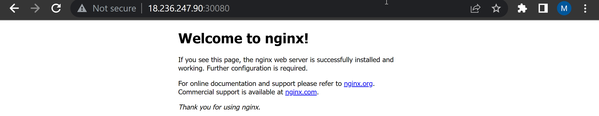
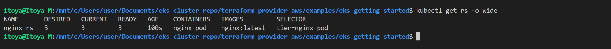

## Deploying a random Pod

1. Create a Pod `nginx-pod.yaml` manifest on your master node
```
 apiVersion: v1
 kind: Pod
 metadata:
   name: nginx-pod
   labels:
     app: nginx-pod
 spec:
   containers:
   - name: nginx
     image: nginx:latest
     ports:
     - containerPort: 80
       protocol: TCP
```

2. Apply the manifest with the help of kubectl
```
kubectl apply -f nginx-pod.yaml
```

3. Get an output of the pods running in the cluster
```
kubectl get pods
```

4. To see other fields introduced by kubernetes after you have deployed the resource, simply run below command
```
kubectl get pod nginx-pod -o yaml 
or
kubectl describe pod nginx-pod
```

### ACCESSING THE APP FROM THE BROWSER
Now you have a running Pod. What’s next?
- We need another Kubernetes object called Service to accept our request and pass it on to the Pod so we can access it through the browser
```
kubectl get pod nginx-pod  -o wide 
```


Let us try to access the Pod through its IP address from within the K8s cluster. To do this,

1. We need an image that already has curl software installed. You can check it out [here](https://hub.docker.com/r/dareyregistry/curl)
`dareyregistry/curl`
2. Run kubectl to connect inside the container
```
kubectl run curl --image=dareyregistry/curl -i --tty
```
3. Run curl and point to the IP address of the Nginx Pod (Use the IP address of your own Pod) 
>  `curl -v 10.0.0.163:80`


### Let us create a service to access the Nginx Pod

1. Create a Service yaml manifest file:
```
apiVersion: v1
kind: Service
metadata:
  name: nginx-service
spec:
  selector:
    app: nginx-pod 
  ports:
    - protocol: TCP
      port: 80
      targetPort: 80
```

2. Create a nginx-service resource by applying your manifest
```
kubectl apply -f nginx-service.yaml
```

3. Check the created service `kubectl get service`

4. To access the app since there is no public IP address, we can leverage kubectl's port-forward functionality.
```
kubectl  port-forward svc/nginx-service 8089:80
```


Unfortunately, this will not work quite yet. Because there is no way the service will be able to select the actual Pod it is meant to route traffic to. If there are hundreds of Pods running, there must be a way to ensure that the service only forwards requests to the specific Pod it is intended for.

- To make this work, you must reconfigure the Pod manifest and introduce labels to match the selectors key in the field section of the service manifest.

1. Update the Pod manifest with the below and apply the manifest:
```
apiVersion: v1
kind: Pod
metadata:
  name: nginx-pod
  labels:
    app: nginx-pod  
spec:
  containers:
  - image: nginx:latest
    name: nginx-pod
    ports:
    - containerPort: 80
      protocol: TCP
```
Apply the manifest with `kubectl apply -f nginx-pod.yaml`

2. Run kubectl port-forward command again
```
kubectl  port-forward svc/nginx-service 8089:80
```
> Then go to your web browser and enter localhost:8089 – You should now be able to see the nginx page in the browser.

### UNDERSTANDING THE CONCEPT

#### Expose a Service on a server’s public IP address & static port

A Node port service type exposes the service on a static port on the node’s IP address. NodePorts are in the 30000-32767 range by default, which means a NodePort is unlikely to match a service’s intended port (for example, 80 may be exposed as 30080).

Update the nginx-service yaml to use a NodePort Service.
```
apiVersion: v1
kind: Service
metadata:
  name: nginx-service
spec:
  type: NodePort
  selector:
    app: nginx-pod
  ports:
    - protocol: TCP
      port: 80
      nodePort: 30080
```

> To access the service, you must:

> Allow the inbound traffic in your EC2’s Security Group to the NodePort range 30000-32767
> Get the public IP address of the node the Pod is running on, append the nodeport and access the app through the browser.



### USING AWS LOAD BALANCER TO ACCESS YOUR SERVICE IN KUBERNETES.

To get the experience of this service type, update your service manifest and use the LoadBalancer type. Also, ensure that the selector references the Pods in the replica set.
```
apiVersion: v1
kind: Service
metadata:
  name: nginx-service
spec:
  type: LoadBalancer
  selector:
    tier: frontend
  ports:
    - protocol: TCP
      port: 80 # This is the port the Loadbalancer is listening at
      targetPort: 80 # This is the port the container is listening at
```

- Apply the configuration `kubectl apply -f nginx-service.yaml`
- Get the newly created service `kubectl get service nginx-service`

- An ELB resource will be created in your AWS console.
- Get the output of the entire yaml for the service. You will some additional information about this service in which you did not define them in the yaml manifest. Kubernetes did this for you.
```
kubectl get service nginx-service -o yaml
```
- Copy and paste the load balancer’s address to the browser, and you will access the Nginx service


### CREATE A REPLICA SET
- Let us create a rs.yaml manifest for a ReplicaSet object
```
#Part 1
apiVersion: apps/v1
kind: ReplicaSet
metadata:
  name: nginx-rs
spec:
  replicas: 3
  selector:
    app: nginx-pod
#Part 2
  template:
    metadata:
      name: nginx-pod
      labels:
         app: nginx-pod
    spec:
      containers:
      - image: nginx:latest
        name: nginx-pod
        ports:
        - containerPort: 80
          protocol: TCP
```
```
kubectl apply -f rs.yaml

kubectl get pods
```

Let us see how we can use both to scale our Replicaset up and down:

**Imperative:**

- We can now easily scale our ReplicaSet up by specifying the desired number of replicas in an imperative command, like this:
```
kubectl scale rs nginx-rs --replicas=5
```


**Declarative:**

- Declarative way would be to open our `rs.yaml manifest`, change desired number of replicas in respective section


### USING DEPLOYMENT CONTROLLERS
**Do not Use Replication Controllers – Use Deployment Controllers Instead**

Officially, it is highly recommended to use Deplyments to manage replica sets rather than using replica sets directly.

Let us see Deployment in action.
1. Delete the ReplicaSet
```
kubectl delete rs nginx-rs
```

2. Create `deployment.yaml` manifest
```
apiVersion: apps/v1
kind: Deployment
metadata:
  name: nginx-deployment
  labels:
    tier: frontend
spec:
  replicas: 1
  selector:
    matchLabels:
      tier: frontend
  template:
    metadata:
      labels:
        tier: frontend
    spec:
      containers:
      - name: nginx
        image: nginx:latest
        ports:
        - containerPort: 80
```

`kubectl apply -f deployment.yaml`

**Run commands to get the following**

1. Get the Deployment
```
kubectl get deployment <name od deployment>
```

2. Get the ReplicaSet
```
kubectl get rs <name of replicasSet>
```
3. Get the Pods
```
kubectl get po <name of pods>
```
4. Scale the replicas in the Deployment to 15 Pods
```
kubectl scale rs <name of replica> --replicas=<number of replica>
```
5. Exec into one of the Pod’s container to run Linux commands
```
kubectl exec <name of pod> -it bash
```
- List the files and folders in the Nginx directory `ls -ltr /etc/nginx/`
- Check the content of the default Nginx configuration file `cat  /etc/nginx/conf.d/default.conf `

### PERSISTING DATA FOR PODS

If you were to update the content of the index.html file inside the container, and the Pod dies, that content will not be lost since a new Pod will replace the dead one.

Let us try that:

1. Scale the Pods down to 1 replica.
2. Exec into the running container 
3. Install vim so that you can edit the file
4. Update the content of the file and add the code below `/usr/share/nginx/html/index.html`
5. Check the browser
6. Now, delete the only running Pod
7. Refresh the web page – You will see that the content you saved in the container is no longer there. That is because Pods do not store data when they are being recreated – that is why they are called ephemeral or stateless
