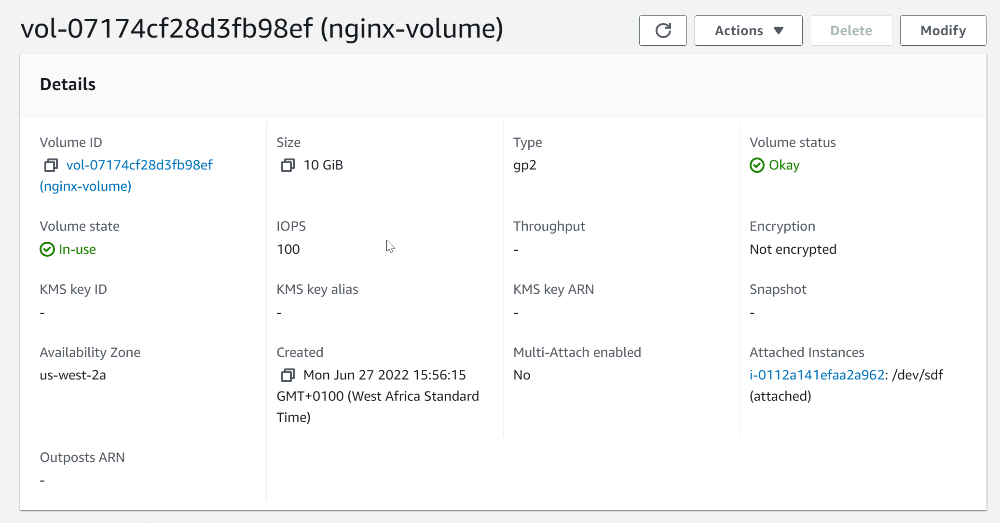
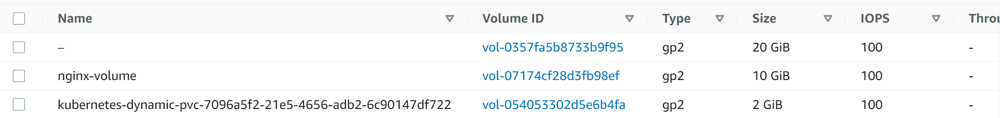
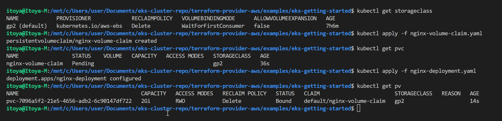
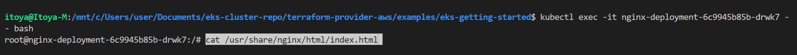
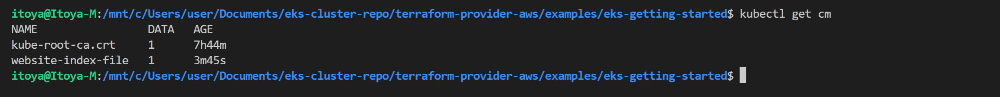

## PERSISTING DATA IN KUBERNETES

1. In your AWS console, head over to the EC2 section and scroll down to the Elastic Block Storage menu
2. Click on Volumes
3. At the top right, click on Create Volume
4. The volume must be created in the same AZ as the node running the pod. Choose the size of the required volume.
  
5. Copy the VolumeID
6. Create and edit the deployment configuration with the volume spec.
```
apiVersion: apps/v1
kind: Deployment
metadata:
  name: nginx-deployment
  labels:
    tier: frontend
spec:
  replicas: 1
  selector:
    matchLabels:
      tier: frontend
  template:
    metadata:
      labels:
        tier: frontend
    spec:
      containers:
      - name: nginx
        image: nginx:latest
        ports:
        - containerPort: 80
      volumes:
      - name: nginx-volume
        # This AWS EBS volume must already exist.
        awsElasticBlockStore:
          volumeID: "vol-07174cf28d3fb98ef"
          fsType: ext4
```
7. Now, the new pod has a volume attached to it, and can be used to run a container for statefuleness. Go ahead and explore the running pod. Run describe on both the pod and deployment
  

8. To complete the configuration, we will need to add another the volume mount section to the deployment yaml manifest. It should look like this after adding:
```
apiVersion: apps/v1
kind: Deployment
metadata:
  name: nginx-deployment
  labels:
    tier: frontend
spec:
  replicas: 1
  selector:
    matchLabels:
      tier: frontend
  template:
    metadata:
      labels:
        tier: frontend
    spec:
      containers:
      - name: nginx
        image: nginx:latest
        ports:
        - containerPort: 80
        volumeMounts:
        - name: nginx-volume
          mountPath: /usr/share/nginx/
      volumes:
      - name: nginx-volume
        # This AWS EBS volume must already exist.
        awsElasticBlockStore:
          volumeID: "vol-07174cf28d3fb98ef"
          fsType: ext4
```

### In as much as we now have a way to persist data, we also have new problems.

1. If you port forward the service and try to reach the endpoint, you will get a 403 error. This is because mounting a volume on a filesystem that already contains data will automatically erase all the existing data. This strategy for statefulness is preferred if the mounted volume already contains the data which you want to be made available to the container


2. It is still a manual process to create a volume, manually ensure that the volume created is in the same Avaioability zone in which the pod is running, and then update the manifest file to use the volume ID. All of these is against DevOps principles because it will mean having a lot of road blocks to getting a simple thing done.

The more elegant way to achieve this is through **Persistent Volume** and **Persistent Volume claims**. In kubernetes, there are many elegant ways of persisting data. Each of which is used to satisfy different use cases. Lets take a look at the different options available.

- Persistent Volume (PV) & Persistent Volume Claim (PVC)
- configMap

## MANAGING VOLUMES DYNAMICALLY WITH PVS AND PVCS
PVs are volume plugins that have a lifecycle completely independent of any individual Pod that uses the PV. This means that even when a pod dies, the PV remains. A PV is a piece of storage in the cluster that is either provisioned by an administrator through a manifest file, or it can be dynamically created if a storage class has been pre-configured.

- Run this command  to check if you already have a storageclass in your cluster `kubectl get storageclass`
- If there is no storage class in your cluster, below manifest is an example of how one would be created
```
  kind: StorageClass
  apiVersion: storage.k8s.io/v1
  metadata:
    name: gp2
    annotations:
      storageclass.kubernetes.io/is-default-class: "true"
  provisioner: kubernetes.io/aws-ebs
  parameters:
    type: gp2
    fsType: ext4 
```

A PersistentVolumeClaim (PVC) on the other hand is a request for storage. Just as Pods consume node resources, PVCs consume PV resources. Pods can request specific levels of resources (CPU and Memory). Claims can request specific size and access modes (e.g., they can be mounted ReadWriteOnce, ReadOnlyMany or ReadWriteMany, 

Now lets create some persistence for our nginx deployment. We will use 2 different approaches.

**Approach 1**

Create a manifest file for a PVC, and based on the gp2 storageClass a PV will be dynamically created
```
    apiVersion: v1
    kind: PersistentVolumeClaim
    metadata:
      name: nginx-volume-claim
    spec:
      accessModes:
      - ReadWriteOnce
      resources:
        requests:
          storage: 2Gi
      storageClassName: gp2
  ```
Apply the manifest file and you will get an output like below
'persistentvolumeclaim/nginx-volume-claim created'


2. Then configure the Pod spec to use the PVC
```
apiVersion: apps/v1
kind: Deployment
metadata:
  name: nginx-deployment
  labels:
    tier: frontend
spec:
  replicas: 1
  selector:
    matchLabels:
      tier: frontend
  template:
    metadata:
      labels:
        tier: frontend
    spec:
      containers:
      - name: nginx
        image: nginx:latest
        ports:
        - containerPort: 80
        volumeMounts:
        - name: nginx-volume-claim
          mountPath: "/tmp/royalt"
      volumes:
      - name: nginx-volume-claim
        persistentVolumeClaim:
          claimName: nginx-volume-claim
```

3. Now lets check the dynamically created PV
`kubectl get pv`

4. You can copy the PV Name and search in the AWS console. You will notice that the volum has been dynamically created there.

### CONFIGMAP

Lets go through the below process so that you can see an example of a configMap use case.

1. Remove the volumeMounts and PVC sections of the manifest and use kubectl to apply the configuration

2. port forward the service and ensure that you are able to see the "Welcome to nginx" page

3. exec into the running container and keep a copy of the index.html file somewhere. For example
```
kubectl exec -it nginx-deployment-6c9945b85b-drwk7 -- bash`
```

```
`cat /usr/share/nginx/html/index.html` 
```
4. Copy the output and save the file on your local pc because we will need it to create a configmap.

### Persisting configuration data with configMaps

1. Use configMap to create a file in a volume
```
apiVersion: v1
kind: ConfigMap
metadata:
  name: website-index-file
data:
  # file to be mounted inside a volume
  index-file: |
    <!DOCTYPE html>
    <html>
    <head>
    <title>Welcome to nginx!</title>
    <style>
    html { color-scheme: light dark; }
    body { width: 35em; margin: 0 auto;
    font-family: Tahoma, Verdana, Arial, sans-serif; }
    </style>
    </head>
    <body>
    <h1>Welcome to nginx!</h1>
    <p>If you see this page, the nginx web server is successfully installed and
    working. Further configuration is required.</p>

    <p>For online documentation and support please refer to
    <a href="http://nginx.org/">nginx.org</a>.<br/>
    Commercial support is available at
    <a href="http://nginx.com/">nginx.com</a>.</p>

    <p><em>Thank you for using nginx.</em></p>
    </body>
    </html>
```
2. Apply the new manifest file
`kubectl apply -f nginx-configmap.yaml`

3. Update the deployment file to use the configmap in the volumeMounts section
```
apiVersion: apps/v1
kind: Deployment
metadata:
  name: nginx-deployment
  labels:
    tier: frontend
spec:
  replicas: 1
  selector:
    matchLabels:
      tier: frontend
  template:
    metadata:
      labels:
        tier: frontend
    spec:
      containers:
      - name: nginx
        image: nginx:latest
        ports:
        - containerPort: 80
        volumeMounts:
          - name: config
            mountPath: /usr/share/nginx/html
            readOnly: true
      volumes:
      - name: config
        configMap:
          name: website-index-file
          items:
          - key: index-file
            path: index.html
```
4. Now the index.html file is no longer ephemeral because it is using a configMap that has been mounted onto the filesystem. This is now evident when you exec into the pod and list the /usr/share/nginx/html directory

You can now see that the index.html is now a soft link to ../data

- Accessing the site will not change anything at this time because the same html file is being loaded through configmap.

- But if you make any change to the content of the html file through the configmap, and restart the pod, all your changes will persist.

Lets try that;

- List the available configmaps. You can either use `kubectl get configmap` or `kubectl get cm`



> We are interested in the website-index-file configmap

- Update the configmap. You can either update the manifest file, or the kubernetes object directly. Lets use the latter approach this time. `kubectl edit cm website-index-file` 
- It will open up a vim editor, or whatever default editor your system is configured to use. Update the content as you like. "Only the html data section", then save the file.

- You should see an output like this `configmap/website-index-file edited`

- Without restarting the pod, your site should be loaded automatically.
- If you wish to restart the deployment for any reason, simply use the command `kubectl rollout restart deploy nginx-deployment` This will terminate the running pod and spin up a new one.