# MERN STACK IMPLEMENTATION ON AWS EC2


### BACKEND CONFIGURATION
- Update ubuntu `sudo apt update`

- Upgrade ubuntu `sudo apt upgrade`

- Get the location of Node.js software from Ubuntu repositories.
`curl -sL https://deb.nodesource.com/setup_12.x | sudo -E bash -`

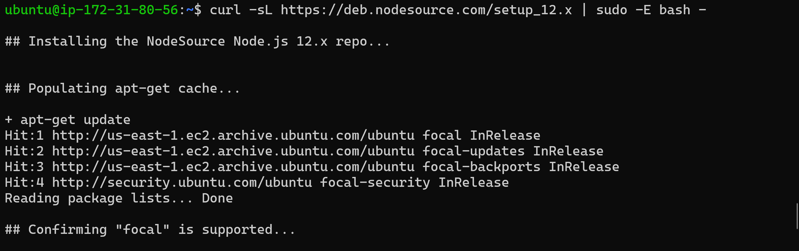

- Install Node.js with the command below `sudo apt-get install -y nodejs`

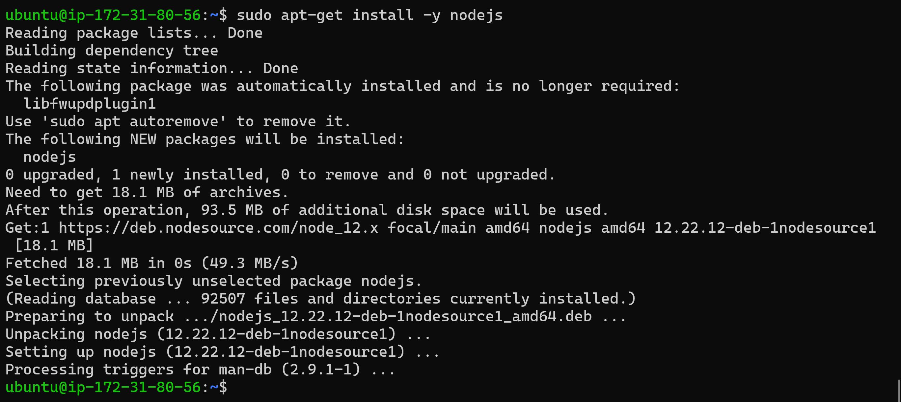

- Verify the node installation with the command `node -v` and Verify the node installation with the command `npm -v` 

- Create a new directory for your To-Do project by running `mkdir Todo` and verify it was created `ls`

-  Initialize your project using `npm init` and run `ls` to verify you have package.json file created.

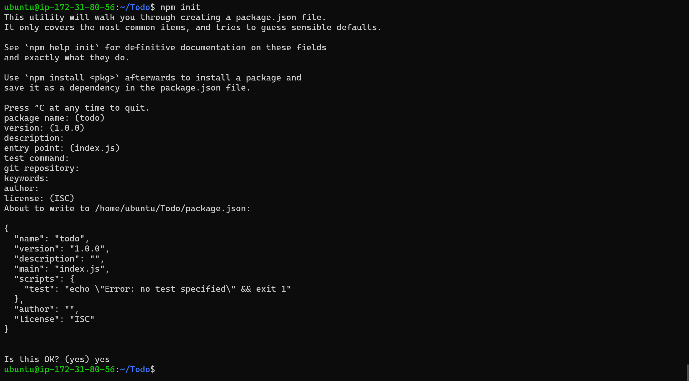

### INSTALL EXPRESSJS

- To use express, install it using npm: `npm install express`
- Create a file index.js: `touch index.js` and run `ls` to confirm it was created.

- Install the dotenv module: `npm install dotenv`

- Open the index.js file: `vim index.js`

- Type the code below into it and save:

```
const express = require('express');
require('dotenv').config();

const app = express();

const port = process.env.PORT || 5000;

app.use((req, res, next) => {
res.header("Access-Control-Allow-Origin", "\*");
res.header("Access-Control-Allow-Headers", "Origin, X-Requested-With, Content-Type, Accept");
next();
});

app.use((req, res, next) => {
res.send('Welcome to Express');
});

app.listen(port, () => {
console.log(`Server running on port ${port}`)
});
```


- Start the server to see if it works. Open your terminal in the same directory as your index.js file and run: `node index.js`
If every thing goes well, you should see Server running on port 5000 in your terminal.

- On your EC2 instance, add an inbound rule to open port 5000. 

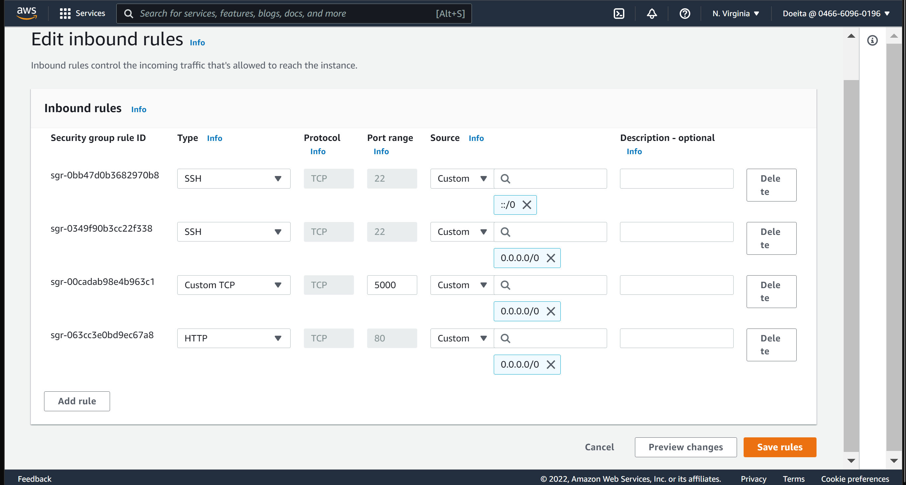

- Open up your browser and try to access your server’s Public IP or Public DNS name followed by port 5000:

`http://<PublicIP-or-PublicDNS>:5000`

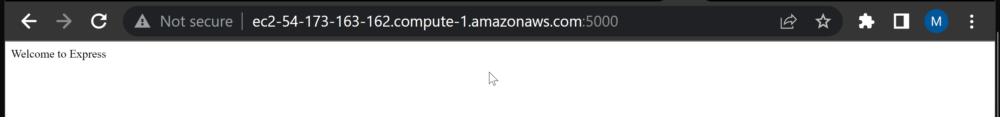

### MODELS

For the todo app to perform different tasks, we need to create api endpoints. This endpoints will use the POST, GET, and DELETE methods.

- Create routes folder and create an api.js file that is going to contain the api endpoints.
```
mkdir routes
touch api.js
```
- Edit api.js with the following code block:
```
const express = require ('express');
const router = express.Router();

router.get('/todos', (req, res, next) => {

});

router.post('/todos', (req, res, next) => {

});

router.delete('/todos/:id', (req, res, next) => {

})

module.exports = router;
```

Install mongoose which helps us connect to mongodb.
`npm install mongoose --save`

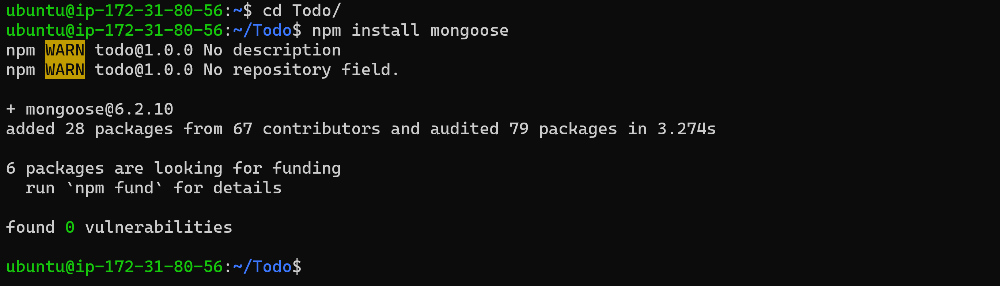

- Create models folder and create a todo.js file in it.
```
mkdir models
touch todo.js
```
Edit todo.js with the following code block:
```
const mongoose = require('mongoose');
const Schema = mongoose.Schema;

//create schema for todo
const TodoSchema = new Schema({
action: {
type: String,
required: [true, 'The todo text field is required']
}
})

//create model for todo
const Todo = mongoose.model('todo', TodoSchema);

module.exports = Todo;
```

- Update the api.js file in routes folder to include the following code which will make use of model:
```
const express = require ('express');
const router = express.Router();
const Todo = require('../models/todo');

router.get('/todos', (req, res, next) => {

//this will return all the data, exposing only the id and action field to the client
Todo.find({}, 'action')
.then(data => res.json(data))
.catch(next)
});

router.post('/todos', (req, res, next) => {
if(req.body.action){
Todo.create(req.body)
.then(data => res.json(data))
.catch(next)
}else {
res.json({
error: "The input field is empty"
})
}
});

router.delete('/todos/:id', (req, res, next) => {
Todo.findOneAndDelete({"_id": req.params.id})
.then(data => res.json(data))
.catch(next)
})

module.exports = router;
```

### MONGODB DATABASE

- Create a modngoDB database on mongodb.com, create a user, allow connection anywhere and also create a collection called todo.

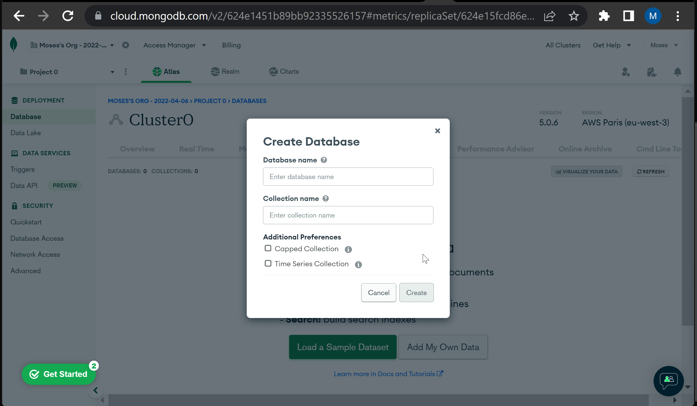

- Create a .env file in the root directory of the project and add the following code:
```
DB = 'mongodb+srv://<username>:<password>@<network-address>/<dbname>?retryWrites=true&w=majority'
```

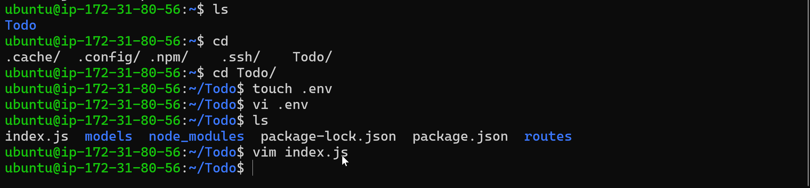

- Edit the index.js file to include the following code:
```
const express = require('express');
const bodyParser = require('body-parser');
const mongoose = require('mongoose');
const routes = require('./routes/api');
const path = require('path');
require('dotenv').config();

const app = express();

const port = process.env.PORT || 5000;

//connect to the database
mongoose.connect(process.env.DB, { useNewUrlParser: true, useUnifiedTopology: true })
.then(() => console.log(`Database connected successfully`))
.catch(err => console.log(err));

//since mongoose promise is depreciated, we overide it with node's promise
mongoose.Promise = global.Promise;

app.use((req, res, next) => {
res.header("Access-Control-Allow-Origin", "\*");
res.header("Access-Control-Allow-Headers", "Origin, X-Requested-With, Content-Type, Accept");
next();
});

app.use(bodyParser.json());

app.use('/api', routes);

app.use((err, req, res, next) => {
console.log(err);
next();
});

app.listen(port, () => {
console.log(`Server running on port ${port}`)
});
```
- Run the server by running the command `node index.js`

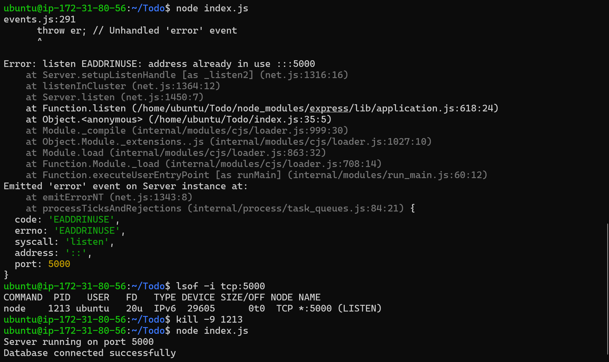

As you can see from tht above image, i had some issues running the server, after some troubleshooting, i discovered i had to kill the current running process on port 5000 for the new one to begin. This i did by first getting the Process Id(PID) for the current process `lsof -i tcp:5000` 

After i got the PID, i killed it using the kill command:

`kill -9 "<the PID>"`

- The images bellow show the use of POST method to query the database.

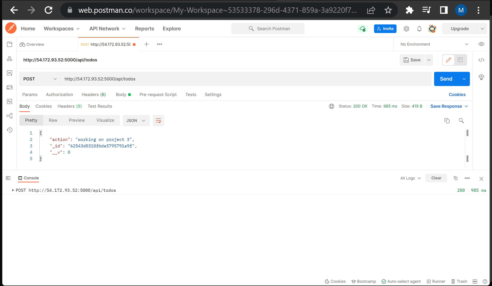

### FRONTEND
- Scaffold a new react project in the root directory of your project with the following commands:
`npx create-react-app client` - This creates a client folder in the root directory of your project.


Another roadblock i had during this project was updating my node version so my react project could be created. I tried a lot of solutions after researching on the problem, quite a number of solutions i found didn't work for me. 
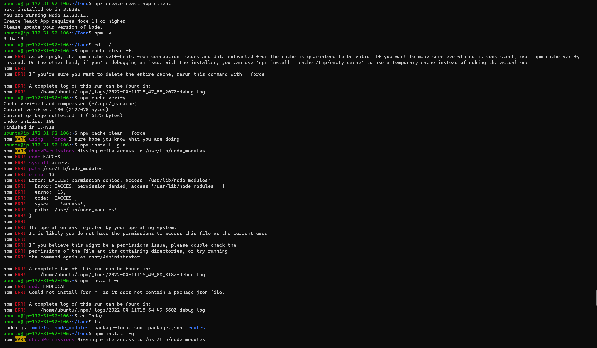

However, this command was able to get the job done for me: `sudo apt install nodejs`. In Hindsight, i think the problem was the permission, SUDO.

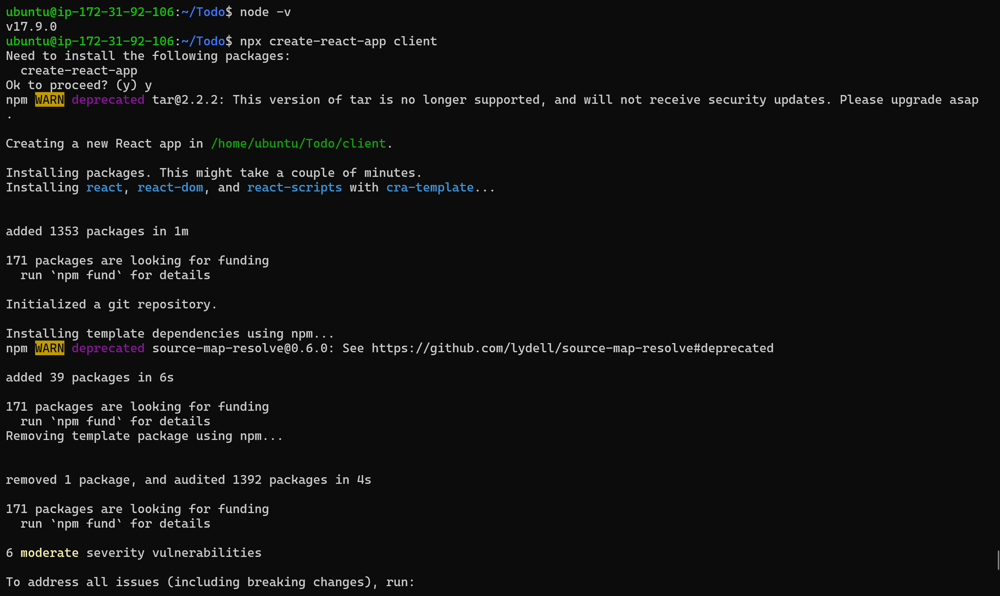

- Install the following dependencies:
```
npm install concurrently --save-dev # used to run more than one command from the same terminal

npm install nodemon --save-dev # used to run and monitor the server againsta any changes.
```

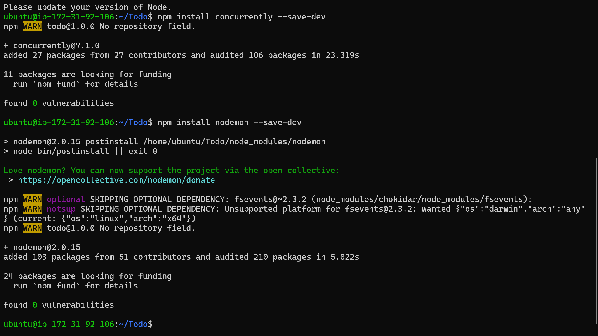

- Edit the scripts section in package.json in the root directory of your project with the following code:
```
"scripts": {
"start": "node index.js",
"start-watch": "nodemon index.js",
"dev": "concurrently \"npm run start-watch\" \"cd client && npm start\""
},
```

- Add a proxy to the server in the pacakge.json client folder with the following code:
`"proxy": "http://Ip-address:5000"`

- Cd to the root folder and Start the app in development mode by running the following command:
`npm run dev`

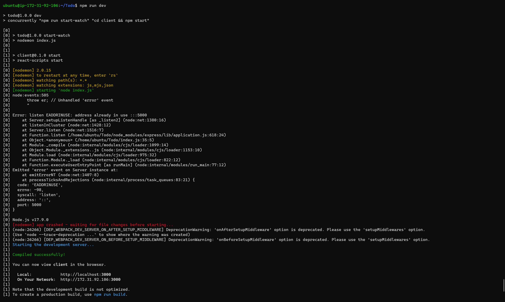

- Enabled port 3000 on the EC2 server inbound rules and

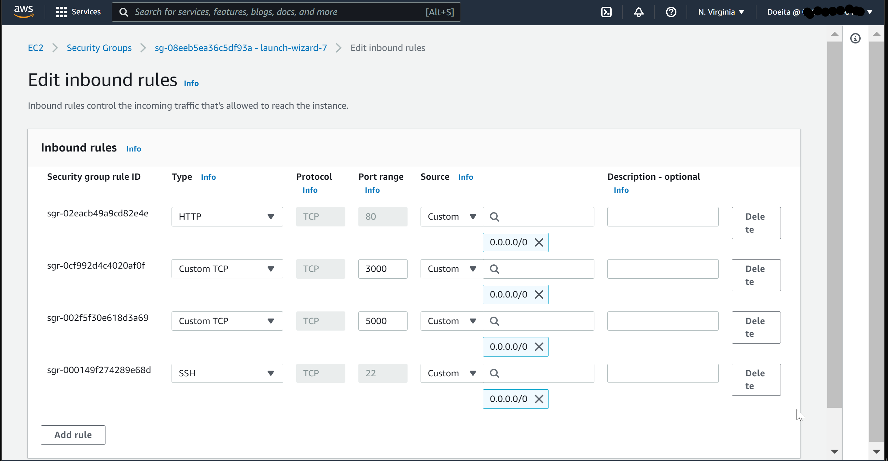

- Create a components folder in src and create Input.js, Todo.js and ListTodo.js files in the components folder.
```
mkdir src/components
touch Input.js
touch Todo.js
touch ListTodo.js
```

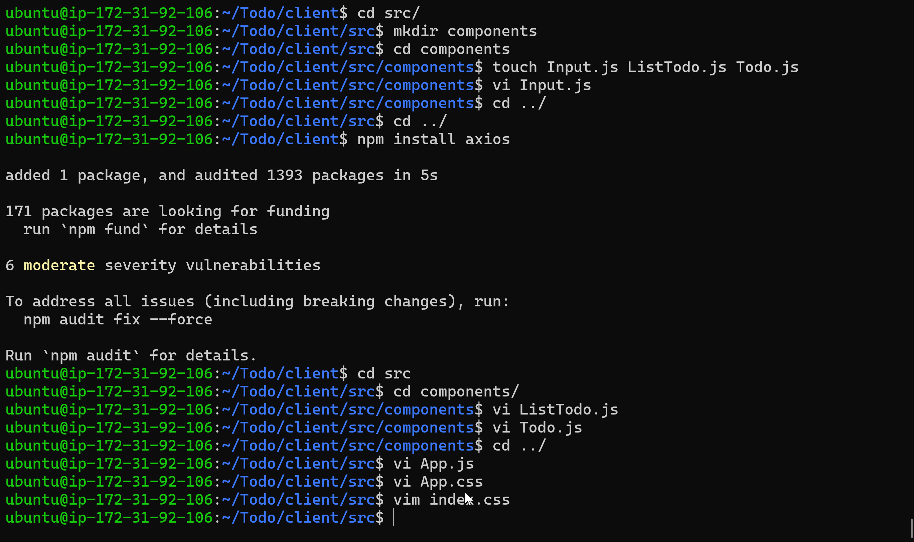

- CD back to src/components folder and Edit the Input.js file with the following code:
```
import React, { Component } from 'react';
import axios from 'axios';

class Input extends Component {

state = {
action: ""
} 

addTodo = () => {
const task = {action: this.state.action}

    if(task.action && task.action.length > 0){
      axios.post('/api/todos', task)
        .then(res => {
          if(res.data){
            this.props.getTodos();
            this.setState({action: ""})
          }
        })
        .catch(err => console.log(err))
    }else {
      console.log('input field required')
    }

}

handleChange = (e) => {
this.setState({
action: e.target.value
})
}

render() {
let { action } = this.state;
return (
<div>
<input type="text" onChange={this.handleChange} value={action} />
<button onClick={this.addTodo}>add todo</button>
</div>
)
}
}

export default Input
```

- Install Axio which helps our application to make http requests to the server.
`npm install axios`

- Edit the ListTodo.js file with the following code:
```
import React from 'react';

const ListTodo = ({ todos, deleteTodo }) => {

return (
<ul>
{
todos &&
todos.length > 0 ?
(
todos.map(todo => {
return (
<li key={todo._id} onClick={() => deleteTodo(todo._id)}>{todo.action}</li>
)
})
)
:
(
<li>No todo(s) left</li>
)
}
</ul>
)
}

export default ListTodo
```

- Edit Todo.js file with the following code:
```
import React, {Component} from 'react';
import axios from 'axios';

import Input from './Input';
import ListTodo from './ListTodo';

class Todo extends Component {

state = {
todos: []
}

componentDidMount(){
this.getTodos();
}

getTodos = () => {
axios.get('/api/todos')
.then(res => {
if(res.data){
this.setState({
todos: res.data
})
}
})
.catch(err => console.log(err))
}

deleteTodo = (id) => {

    axios.delete(`/api/todos/${id}`)
      .then(res => {
        if(res.data){
          this.getTodos()
        }
      })
      .catch(err => console.log(err))

}

render() {
let { todos } = this.state;

    return(
      <div>
        <h1>My Todo(s)</h1>
        <Input getTodos={this.getTodos}/>
        <ListTodo todos={todos} deleteTodo={this.deleteTodo}/>
      </div>
    )

}
}

export default Todo;
```
- cd to the src folder and edit App.js with the following code:
```
import React from 'react';

import Todo from './components/Todo';
import './App.css';

const App = () => {
return (
<div className="App">
<Todo />
</div>
);
}

export default App;
``` 
- Edit App.css file with the following code:
```
.App {
text-align: center;
font-size: calc(10px + 2vmin);
width: 60%;
margin-left: auto;
margin-right: auto;
}

input {
height: 40px;
width: 50%;
border: none;
border-bottom: 2px #101113 solid;
background: none;
font-size: 1.5rem;
color: #787a80;
}

input:focus {
outline: none;
}

button {
width: 25%;
height: 45px;
border: none;
margin-left: 10px;
font-size: 25px;
background: #101113;
border-radius: 5px;
color: #787a80;
cursor: pointer;
}

button:focus {
outline: none;
}

ul {
list-style: none;
text-align: left;
padding: 15px;
background: #171a1f;
border-radius: 5px;
}

li {
padding: 15px;
font-size: 1.5rem;
margin-bottom: 15px;
background: #282c34;
border-radius: 5px;
overflow-wrap: break-word;
cursor: pointer;
}

@media only screen and (min-width: 300px) {
.App {
width: 80%;
}

input {
width: 100%
}

button {
width: 100%;
margin-top: 15px;
margin-left: 0;
}
}

@media only screen and (min-width: 640px) {
.App {
width: 60%;
}

input {
width: 50%;
}

button {
width: 30%;
margin-left: 10px;
margin-top: 0;
}
}

```

-In the src directory open the index.css Copy and paste the code below:
```
body {
margin: 0;
padding: 0;
font-family: -apple-system, BlinkMacSystemFont, "Segoe UI", "Roboto", "Oxygen",
"Ubuntu", "Cantarell", "Fira Sans", "Droid Sans", "Helvetica Neue",
sans-serif;
-webkit-font-smoothing: antialiased;
-moz-osx-font-smoothing: grayscale;
box-sizing: border-box;
background-color: #282c34;
color: #787a80;
}

code {
font-family: source-code-pro, Menlo, Monaco, Consolas, "Courier New",
monospace;
}
```

- cd to the Todo directory to start the app in development mode.
`npm run dev`

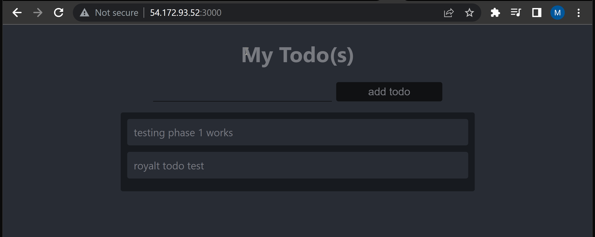