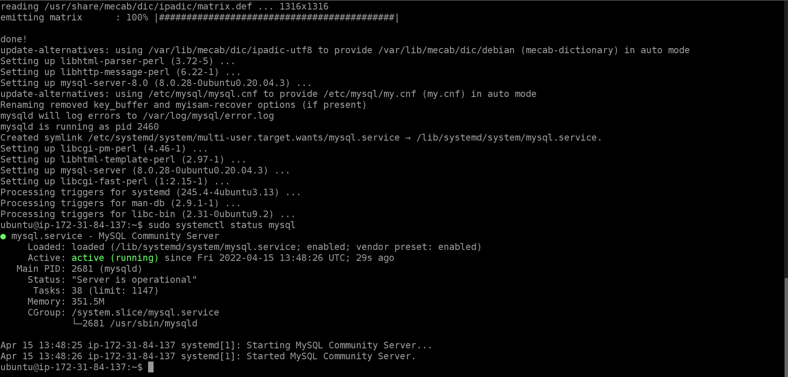

## CLIENT SERVER ARCHITECTURE USING MYSQL DATABASE MANAGEMENT SYSTEM (DBMS).
Lauch 2 EC2 instances. First one for the client and second one for the server. Add an inbound rule to the security group of the server instance to allow the client instance to connect to the server instance (allow only the IP address of the client server on MYSQL Default port 3306).

1. Installing the MySQL Server on server A (MySql Server's ec2 instance):
- Update the apt package index, install the package and start the service.
```
sudo apt update && sudo apt install mysql-server && sudo systemctl start mysql.service
```




2. Installing the MySQL Client on server B (MySql Client's ec2 instance):
- Update the apt package index, install the package and start the service.
```
sudo apt update && sudo apt install mysql-client && sudo systemctl start mysql.service
```


- Configure MySql by Running the mysql security script: `sudo mysql_secure_installation`


- Add an inbound rule to the security group of the server instance to allow the client instance to connect to the server instance (allow only the IP address of the client server on MYSQL Default port 3306).


- Edit MYSQL configuration file to allow remote access to MySQL server and replace 127.0.0.1 with 0.0.0.0. 
```
sudo nano /etc/mysql/mysql.conf.d/mysqld.cnf
```


- Restart MySQL server:
`sudo service mysql restart`

3. MySql user and Database configuration:

- First run `Sudo MySql` which will open up the MySql terminal. Then create a new user and database for the project.
```
CREATE USER 'admin123'@'%' IDENTIFIED WITH mysql_native_password BY 'password';

GRANT ALL PRIVILEGES ON admin_test_db.* TO 'admin123'@'%' WITH GRANT OPTION;

CREATE DATABASE admin_test_db;

FLUSH PRIVILEGES;
```


4. Connecting to the MySQL Server on server B from the client on server A:

- Connect to the MySQL server from the MySQL Client instance without using ssh by runing the following command: `sudo mysql -u admin123 -h <your mysql server private ip> -p`

- Test that the user has the given privileges: `SHOW DATABASES;`

