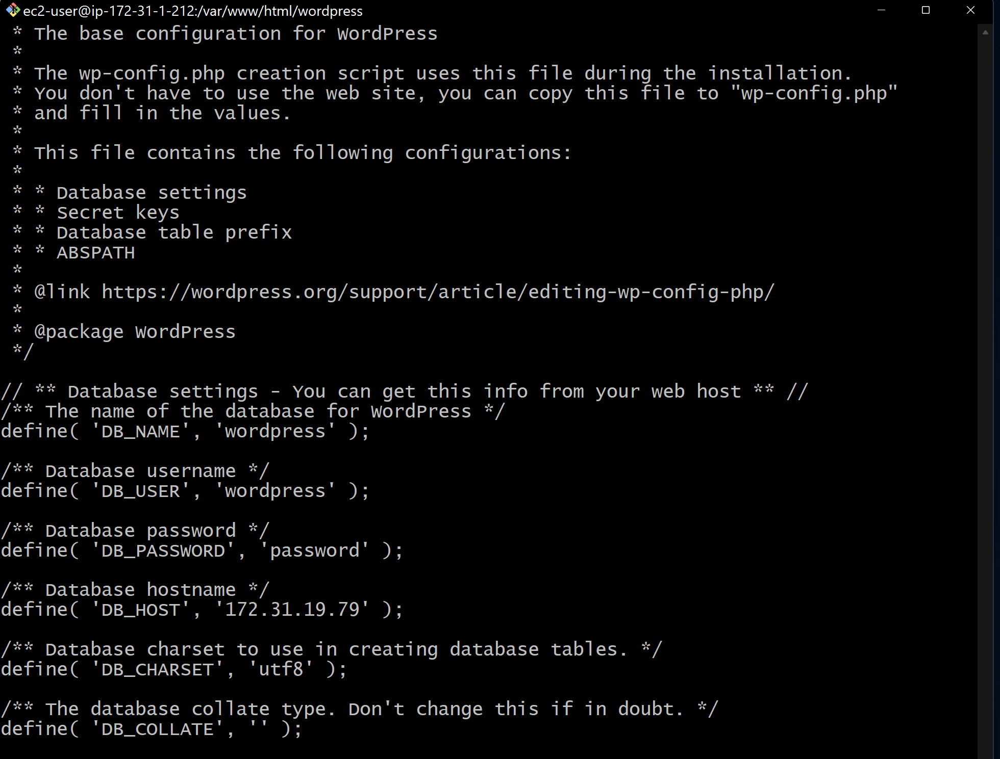

# Web Solution With WordPress
In this project we will prepare storage infrastructure on two Linux servers on AWS and implement a basic web solution using WordPress.

## Step 1 — Prepare a Web Server
* Launch an EC2 instance that will serve as “Web Server”. Create 3 volumes in the same AZ as your Web Server EC2, each of 10 GiB.


* Attach all three volumes one by one to your Web Server EC2 instance


---
* Open up the Linux terminal to begin configuration

* Use lsblk command to inspect what block devices are attached to the server. Notice names of your newly created devices. 


* Use `df -h` command to see all mounts and free space on your server.


* Use gdisk utility to create a single partition on each of the 3 disks.
```
sudo gdisk /dev/xvdf
```


* Use `lsblk` utility to view the newly configured partition on each of the 3 disks. 


---
* Install `lvm2` package using `sudo yum install lvm2`. 


* Run `sudo lvmdiskscan` command to check for available partitions.


---
* Use `pvcreate` utility to mark each of 3 disks as physical volumes (PVs) to be used by LVM
```
sudo pvcreate /dev/xvdf1
sudo pvcreate /dev/xvdg1
sudo pvcreate /dev/xvdh1
```
* Verify that your Physical volume has been created successfully by running `sudo pvs`
---
* Use `vgcreate` utility to add all 3 PVs to a volume group (VG). Name the VG 'webdata-vg'
```
sudo vgcreate webdata-vg /dev/xvdh1 /dev/xvdg1 /dev/xvdf1
```
* Verify that your VG has been created successfully by running `sudo vgs`
---
* Use `lvcreate` utility to create 2 logical volumes. 'apps-lv' (Use half of the PV size), and 'logs-lv' Use the remaining space of the PV size.
```
sudo lvcreate -n apps-lv -L 14G webdata-vg
sudo lvcreate -n logs-lv -L 14G webdata-vg
```
apps-lv will be used to store data for the Website while, logs-lv will be used to store data for logs.

* Verify that your Logical Volume has been created successfully by running `sudo lvs`


---
* Verify the entire setup
```
sudo vgdisplay -v #view complete setup - VG, PV, and LV
sudo lsblk 
```


---

* Use `mkfs.ext4` to format the logical volumes with ext4 filesystem
```
sudo mkfs -t ext4 /dev/webdata-vg/apps-lv
sudo mkfs -t ext4 /dev/webdata-vg/logs-lv
```


---
* Create `/var/www/html` directory to store website files
```
sudo mkdir -p /var/www/html
```
* Create `/home/recovery/`logs to store backup of log data
```
sudo mkdir -p /home/recovery/logs
```
* Mount `/var/www/html` on 'apps-lv' logical volume
```
sudo mount /dev/webdata-vg/apps-lv /var/www/html/
```

---

* Use `rsync` utility to backup all the files in the log directory `/var/log` into `/home/recovery/logs` (This is required before mounting the file system)
```
sudo rsync -av /var/log/. /home/recovery/logs/
```


* Mount `/var/log` on `logs-lv` logical volume. (Note that all the existing data on /var/log will be deleted. That is why step above is very important)
```
sudo mount /dev/webdata-vg/logs-lv /var/log
```
* Restore log files back into `/var/log` directory
```
sudo rsync -av /home/recovery/logs/. /var/log
```

The UUID of the device will be used to update the /etc/fstab file;

* Update `/etc/fstab` file so that the mount configuration will persist after restart of the server.
```
sudo blkid
```


* Update `/etc/fstab` in this format using your own UUID and remember to remove the leading and ending quotes.
```
sudo vi /etc/fstab
```


---
* Test the configuration and reload the daemon
```
sudo mount -a
sudo systemctl daemon-reload
```
* Verify your setup by running `df -h`

---

## Step 2 — Prepare the Database Server
Launch a second RedHat EC2 instance that will have a role - ‘DB Server’ Repeat the same steps as for the Web Server, but instead of apps-lv create db-lv and mount it to /db directory instead of /var/www/html/.


## Step 3 — Install MySQL on your DB Server EC2
* Connect to database server and install MySQL
```
sudo yum update
sudo yum install mysql-server
```

* Verify that the service is up and running by using `sudo systemctl status mysqld`, if it is not running, restart the service and enable it so it will be running even after reboot:
```
sudo systemctl restart mysqld
sudo systemctl enable mysqld
```


---
## Step 4 — Configure DB to work with WordPress

* Start mysql service and create database and user
```
sudo mysql
CREATE DATABASE wordpress;
CREATE USER `myuser`@`<Web-Server-Private-IP-Address>` IDENTIFIED BY 'mypass';
GRANT ALL ON wordpress.* TO 'myuser'@'<Web-Server-Private-IP-Address>';
FLUSH PRIVILEGES;
SHOW DATABASES;
exit
```

---
## Step 5 — Configure WordPress to connect to remote database
* Do not forget to open MySQL port 3306 on DB Server EC2. For extra security, you shall allow access to the DB server ONLY from your Web Server’s IP address, so in the Inbound Rule configuration specify source as /32


* Install MySQL client and test that you can connect from your Web Server to your DB server by using `mysql-client`
```
sudo yum install mysql
sudo mysql -u admin -p -h <DB-Server-Private-IP-address>
```

* Verify if you can successfully execute SHOW DATABASES; command and see a list of existing databases.


* Change permissions and configuration so Apache could use WordPress:
```
sudo mv /etc/httpd/conf.d/welcome.conf /etc/httpd/conf.d/welcome.conf_backup
sudo chown -R apache:apache /var/www/html/wordpress
sudo chcon -t httpd_sys_rw_content_t /var/www/html/wordpress -R
sudo setsebool -P httpd_can_network_connect=1
sudo setsebool -P httpd_can_network_connect_db=1
```


* Enter database details into `wp-config.php`
```
sudo vi /var/www/html/wordpress/wp-config.php
```


* Enable TCP port 80 in Inbound Rules configuration for your Web Server EC2 (enable from everywhere 0.0.0.0/0 or from your workstation’s IP)

 
* Try to access from your browser the link to your WordPress `http://<Web-Server-Public-IP-Address>/wordpress/` and fill out your credentials


If you see this page - it means your WordPress has successfully connected to your remote MySQL database

