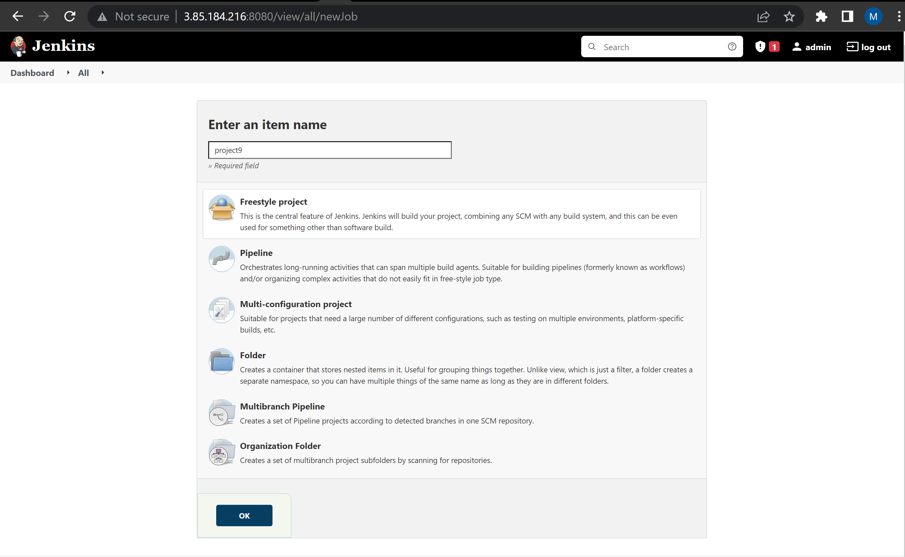

# INSTALL AND CONFIGURE JENKINS SERVER

### Step 1 – Install Jenkins server

1. Create an EC2 ubuntu instance


2. Install JDK
```
sudo apt update
sudo apt install default-jdk-headless
```
3. Install Jenkins
```
wget -q -O - https://pkg.jenkins.io/debian-stable/jenkins.io.key | sudo apt-key add -
sudo sh -c 'echo deb https://pkg.jenkins.io/debian-stable binary/ > \
    /etc/apt/sources.list.d/jenkins.list'
sudo apt update
sudo apt-get install jenkins
```


* Check the status of Jenkins to make sure its running
```
sudo systemctl status jenkins
``` 


4. Open TCP port 80 for the Jenkins server security group.


5. Setup Jenkins. 
`http://<Jenkins-Server-Public-IP-Address-or-Public-DNS-Name>:8080` to setup jenkins with the admin password and also install the suggested plugins. <br>
Run the command below to retrieve the admin password
```
sudo cat /var/lib/jenkins/secrets/initialAdminPassword
```


### Step 2 – Configure Jenkins to retrieve source codes from GitHub using Webhooks
Webhooks help automate the build of projects based on some triggers. With this project the build is triggered when a new update is pushed to the master branch.

1. Enable webhooks in your GitHub repository settings


2. Go to Jenkins web console, click "New Item" and create a "Freestyle project". Give the project a name and click ok.



* Configure the project to connect with your GitHub repository by entering the URL and credentials.

* Save the configuration and click on the "Build Now" link.


* The Workspace for the first job has retrieved all the files/directories from the GitHub repository and stored it locally.

* This build is triggered only when activated manually. Add additional configurations to the project "project9". Click “Configure” your job/project and add these two configurations: On Build triggers, select "Github hook trigger for GITScm polling". Configure “Post-build Actions” to archive all the files - files resulted from a build are called “artifacts”

Any changes to the GitHub master branch automatically trigger a new build on the Jenkins server and the artifacts are updated and archived. The updated artifacts can also be accessible at 
```
ls /var/lib/jenkins/jobs/project9/builds/<build_number>/archive/
```


### Step 3 – Configure Jenkins to copy files to NFS server via SSH

1. Install "Publish Over SSH" plugin. This will allow us copy our files to the NFS server which is shared across all webserver.

2. Configure the job/project to copy artifacts over to NFS server.

On main dashboard select "Manage Jenkins" and choose "Configure System" menu item.


Scroll down to Publish over SSH plugin configuration section and configure it to be able to connect to your NFS server:

- Provide a private key (content of .pem file that you use to connect to NFS server via SSH/Putty)
- Arbitrary name
- Hostname – can be private IP address of your NFS server
- Username – ec2-user (since NFS server is based on EC2 with RHEL 8)
- Remote directory – /mnt/apps since our Web Servers use it as a mointing point to retrieve files from the NFS server.

Click the Test the connection button. If everything is setup correctly,you should get a success message.

N.B: TCP port 22 on NFS server must be open to receive SSH connections.

3. Save the configuration

4. Open Jenkins job/project configuration page and add another one "Post-build Action"

5. Select Send build over ssh  and enter **  in the text box infront of Source files

6. Save the configuration.

7. Make changes in repo and commit. Authomatic build should be triggered on jenkins and files sent to the NFS Server.

8. You can visit mnt/apps on NFS server to open the file you updated to see your new changes.


